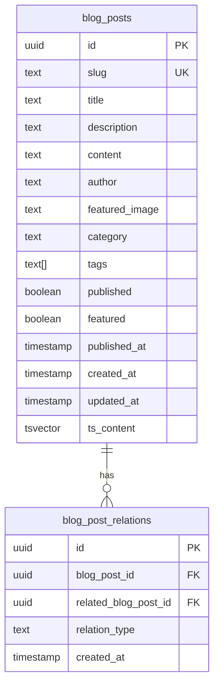
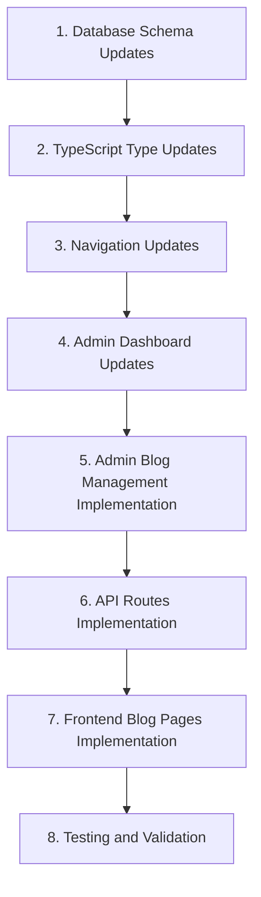

# Admin Publishing Workflow Documentation

This document outlines how the publishing workflow is implemented for content types in the admin panel, using Algorithms as the reference implementation. The same patterns can be applied to other content types like Personas, Industries, Blog posts, and Case Studies.

## Table of Contents

1. [Database Structure](#database-structure)
2. [API Routes](#api-routes)
3. [Client Components](#client-components)
4. [Publishing Workflow](#publishing-workflow)
5. [Common Issues and Solutions](#common-issues-and-solutions)

## Database Structure

### Content Tables

Each content type has its own table in the database with a `published` boolean field:

```sql
create table algorithms (
    id uuid default uuid_generate_v4() primary key,
    slug text unique not null,
    name text not null,
    description text,
    main_content text,
    published boolean default false,
    quantum_advantage text,
    use_cases text[],
    created_at timestamp with time zone default now(),
    updated_at timestamp with time zone default now(),
    ts_content tsvector
);
```

### Junction Tables for Relationships

For many-to-many relationships, we use junction tables instead of array fields. This provides better data integrity and query performance:

```sql
create table algorithm_case_study_relations (
    id uuid default uuid_generate_v4() primary key,
    algorithm_id uuid references algorithms(id) on delete cascade,
    case_study_id uuid references case_studies(id) on delete cascade,
    created_at timestamp with time zone default now(),
    unique(algorithm_id, case_study_id)
);
```

### Row Level Security (RLS)

Junction tables have Row Level Security enabled with policies for admin access:

```sql
alter table algorithm_case_study_relations enable row level security;

create policy "Admins can manage algorithm_case_study_relations"
  on algorithm_case_study_relations
  for all
  using (auth.jwt() ->> 'role' = 'admin');
```

## API Routes

### GET Handler

The GET handler fetches content items and their relationships:

```typescript
// For a specific item by slug
if (slug) {
  const { data: algorithm, error } = await supabase
    .from('algorithms')
    .select('*')
    .eq('slug', slug)
    .single();
    
  if (error || !algorithm) {
    return NextResponse.json(
      { error: 'Algorithm not found' },
      { status: 404 }
    );
  }
  
  // Fetch related case studies from the junction table
  // Use service role client for junction table operations to bypass RLS
  const serviceClient = createServiceClient();
  const { data: relations, error: relationsError } = await serviceClient
    .from('algorithm_case_study_relations')
    .select(`
      case_study_id,
      case_studies:case_studies(id, slug, title)
    `)
    .eq('algorithm_id', algorithm.id);
    
  if (!relationsError && relations) {
    // Extract the case study information
    const relatedCaseStudies = relations.map(relation => relation.case_studies);
    (algorithm as any).related_case_studies = relatedCaseStudies;
  }
  
  return NextResponse.json(algorithm);
}
```

### POST Handler

The POST handler creates or updates content items and manages relationships:

```typescript
// Handle relationships with case studies using the junction table
if (relatedCaseStudies.length > 0) {
  console.log('Updating case study relationships for algorithm:', id);
  
  // First, delete existing relationships for this algorithm
  // Use service role client for junction table operations to bypass RLS
  const serviceClient = createServiceClient();
  const { error: deleteError } = await serviceClient
    .from('algorithm_case_study_relations')
    .delete()
    .eq('algorithm_id', id);
    
  if (deleteError) {
    console.error('Error deleting existing case study relationships:', deleteError);
  }
  
  // Then, insert new relationships
  const relationInserts = [];
  for (const caseStudySlug of relatedCaseStudies) {
    // Get the case study ID from the slug
    const { data: caseStudyData, error: caseStudyError } = await supabase
      .from('case_studies')
      .select('id')
      .eq('slug', caseStudySlug)
      .single();
      
    if (caseStudyError || !caseStudyData) {
      console.error(`Error finding case study with slug ${caseStudySlug}:`, caseStudyError);
      continue;
    }
    
    relationInserts.push({
      algorithm_id: id,
      case_study_id: caseStudyData.id
    });
  }
  
  if (relationInserts.length > 0) {
    // Use service role client for junction table operations to bypass RLS
    const serviceClient = createServiceClient();
    const { error: insertError } = await serviceClient
      .from('algorithm_case_study_relations')
      .insert(relationInserts);
      
    if (insertError) {
      console.error('Error inserting case study relationships:', insertError);
    } else {
      console.log(`Successfully inserted ${relationInserts.length} case study relationships`);
    }
  }
}
```

### DELETE Handler

The DELETE handler removes content items and their relationships:

```typescript
// First delete the relationships in the junction table
// Use service role client for junction table operations to bypass RLS
const serviceClient = createServiceClient();
const { error: relDeleteError } = await serviceClient
  .from('algorithm_case_study_relations')
  .delete()
  .eq('algorithm_id', id);
  
if (relDeleteError) {
  console.error('Error deleting algorithm relationships:', relDeleteError);
  // Continue with deletion even if relationship deletion fails
}

// Then delete the algorithm
const { error: deleteError } = await supabase
  .from('algorithms')
  .delete()
  .eq('id', id);
```

## Client Components

### Form State Management

The client component manages form state using React's useState hook:

```typescript
const [values, setValues] = useState<FormValues>({
  id: initialData?.id || '',
  name: initialData?.name || '',
  slug: initialData?.slug || '',
  description: initialData?.description || '',
  main_content: initialData?.main_content || '',
  published: initialData?.published || false,
  use_cases: initialData?.use_cases || [],
  related_case_studies: initialData?.related_case_studies?.map(cs => cs.slug) || [],
  related_industries: initialData?.related_industries?.map(ind => ind.slug) || []
});
```

### Tab Navigation with Auto-Save

When changing tabs, the form is automatically saved if required fields are filled:

```typescript
const handleTabChange = async (value: string) => {
  // Only save if there are changes and required fields are filled
  if (values.name && values.slug) {
    setIsSaving(true)
    try {
      // Create a synthetic event for the form submission
      const event = new Event('submit') as any
      event.preventDefault = () => {}
      
      await handleSubmit(event)
      setActiveTab(value)
    } catch (error) {
      toast({
        variant: 'destructive',
        title: 'Error',
        description: 'Failed to save before changing tabs',
      })
    } finally {
      setIsSaving(false)
    }
  } else {
    // If required fields aren't filled, just change tabs without saving
    setActiveTab(value)
  }
}
```

### Publishing Workflow

The publish button validates content before publishing:

```typescript
onClick={async () => {
  // If trying to publish, validate content
  if (!values.published) {
    const isValid = validateContent();
    if (!isValid) {
      setShowValidationModal(true);
      return;
    }
    
    console.log('Before publishing - current state:', { ...values });
    
    // If valid, publish
    setValues(prev => {
      console.log('Setting published=true, prev state:', prev);
      return {
        ...prev,
        published: true
      };
    });
    
    // Need to wait for state update to complete
    setTimeout(async () => {
      // Log state after setting published to true
      console.log('After setting published=true, current values:', { ...values });
      
      // Save the form with the published state
      const event = new Event('submit') as any;
      event.preventDefault = () => {};
      
      // Create a payload manually to ensure published is set
      const payload = new FormData();
      if (values.id) {
        payload.append('id', values.id);
      }
      payload.append('name', values.name);
      payload.append('slug', values.slug);
      payload.append('description', values.description || '');
      payload.append('main_content', values.main_content || '');
      payload.append('published', 'on'); // Force published to be true
      
      // Handle array fields
      if (values.use_cases && values.use_cases.length > 0) {
        payload.append('use_cases', values.use_cases.join(', '));
      }
      
      // Handle relationships
      values.related_case_studies.forEach(slug => {
        payload.append('related_case_studies[]', slug);
      });
      
      values.related_industries.forEach(slug => {
        payload.append('related_industries[]', slug);
      });
      
      console.log('Manual payload published value:', payload.get('published'));
      
      // Submit the form data
      const response = await fetch('/api/algorithms', {
        method: 'POST',
        body: payload,
      });
      
      if (!response.ok) {
        console.error('Failed to save algorithm:', await response.text());
        toast({
          variant: 'destructive',
          title: 'Error',
          description: 'Failed to publish algorithm',
          duration: 5000,
        });
      } else {
        const data = await response.json();
        console.log('API response after manual publish:', data);
        
        // Update the last saved timestamp
        setLastSaved(new Date().toLocaleTimeString());
        
        toast({
          title: 'Published',
          description: 'Content is now published and visible to users',
          duration: 3000,
        });
      }
    }, 100);
  }
}
```

### Content Validation

The validateContent function checks if all required fields are filled:

```typescript
const validateContent = (): boolean => {
  const issues: Record<string, {name: string, label: string}[]> = {};
  
  // Basic tab validation
  const basicIssues = [];
  if (!values.name.trim()) {
    basicIssues.push({ name: 'name', label: 'Name is required' });
  }
  if (!values.slug.trim()) {
    basicIssues.push({ name: 'slug', label: 'Slug is required' });
  }
  if (basicIssues.length) {
    issues.basic = basicIssues;
  }
  
  // Content tab validation
  const contentIssues = [];
  if (!values.main_content.trim()) {
    contentIssues.push({ name: 'main_content', label: 'Main content is required' });
  }
  if (contentIssues.length) {
    issues.content = contentIssues;
  }
  
  // Relationships tab validation
  const relationshipIssues = [];
  if (values.related_case_studies.length === 0) {
    relationshipIssues.push({
      name: 'related_case_studies',
      label: 'At least one related case study is required'
    });
  }
  if (relationshipIssues.length) {
    issues.relationships = relationshipIssues;
  }
  
  // Update state with validation issues
  setValidationIssues(issues);
  
  // Return true if no issues found
  return Object.keys(issues).length === 0;
};
```

## Publishing Workflow

The publishing workflow follows these steps:

1. User fills out content in various tabs (Basic Info, Content, Technical Details, Relationships)
2. When changing tabs, content is automatically saved if required fields are filled
3. When clicking the Publish button:
   - Content is validated to ensure all required fields are filled
   - If validation fails, a modal shows the missing fields
   - If validation passes, the published flag is set to true
   - The form is submitted with the published flag
4. The API route:
   - Updates the content item with the published flag
   - Manages relationships in the junction table
   - Returns the updated content item
5. The UI updates to show the content as published

## Common Issues and Solutions

### 1. Junction Table Permissions

**Issue**: Junction tables with Row Level Security (RLS) may prevent regular clients from inserting/updating/deleting records.

**Solution**: Use the service role client for operations on junction tables:

```typescript
import { createServiceClient } from '@/utils/supabase/service-role';

// Use service role client for junction table operations
const serviceClient = createServiceClient();
const { error } = await serviceClient
  .from('algorithm_case_study_relations')
  .delete()
  .eq('algorithm_id', id);
```

### 2. React State Update Timing

**Issue**: React state updates are asynchronous, so the published flag may not be set in time for the form submission.

**Solution**: Use a manual approach with setTimeout and explicitly set the published flag:

```typescript
// Need to wait for state update to complete
setTimeout(async () => {
  // Create a payload manually to ensure published is set
  const payload = new FormData();
  payload.append('published', 'on'); // Force published to be true
  
  // Submit the form data
  const response = await fetch('/api/algorithms', {
    method: 'POST',
    body: payload,
  });
}, 100);
```

### 3. SQL Query Syntax Errors

**Issue**: Complex SQL queries with window functions may cause syntax errors in the Supabase PostgREST API.

**Solution**: Simplify the select statement and avoid using window functions:

```typescript
// Instead of:
.select(`
  *,
  industries (*),
  algorithms (*),
  count(*) over() as total_count
`, { count: 'exact' })

// Use:
.select(`
  *,
  industries (*),
  algorithms (*)
`, { count: 'exact' })
```

### 4. Relationship Queries

**Issue**: When fetching related items, using the wrong field (e.g., name instead of slug) can cause errors.

**Solution**: Ensure you're using the correct field for relationship queries:

```typescript
// Instead of:
const response = await fetch(
  `/api/case-studies?algorithm=${encodeURIComponent(algorithm.name)}`,
  { cache: 'no-store' }
);

// Use:
const response = await fetch(
  `/api/case-studies?algorithm=${encodeURIComponent(algorithm.slug)}`,
  { cache: 'no-store' }
);
```

## Implementing for Other Content Types

To implement this workflow for other content types (Personas, Industries, Case Studies):

1. Create junction tables for many-to-many relationships
2. Update API routes to use the service role client for junction table operations
3. Implement the same client-side validation and publishing workflow
4. Ensure proper state management for the published flag

By following this pattern, you can create a consistent publishing workflow across all content types in the admin panel.

## Implementation Progress

### Current State

#### Algorithms (Reference Implementation)
- ✅ Complete publishing workflow with:
  - `published` boolean field in the database
  - Multi-tab form interface with auto-save
  - Content validation before publishing
  - Content completeness indicator
  - Validation modal for missing required fields
  - Relationship management with case studies using junction tables

#### Personas & Industries
- ✅ Complete publishing workflow implemented following the Algorithms pattern
- ✅ Database schema updated with `published` and `updated_at` fields
- ✅ Client components with tab navigation, auto-save, and validation
- ✅ API routes updated to handle the publishing workflow
- ✅ TypeScript types updated to include new fields

#### Case Studies (Completed)
- ✅ Complete publishing workflow implemented following the Algorithms pattern:
  - Multi-tab form interface (Basic Info, Content, Classifications, Technical Details)
  - Auto-save functionality when changing tabs
  - Content validation before publishing
  - Content completeness tracking with visual indicator
  - Validation modal for missing required fields
  - Publishing/unpublishing controls
  - Relationship management with algorithms, industries, and personas
- ✅ Client component (`src/app/admin/case-studies/[id]/client.tsx`) with React state management
- ✅ Updated page component to fetch and pass data to the client component
- ✅ Leveraging existing API route that already supported the publishing workflow
- ✅ Basic list view with published status indicator
- ✅ Simple edit link
- ✅ Detailed edit form with tabs (Basic Info, Content, Classifications, Technical Details)
- ✅ Form validation with required fields
- ✅ Auto-save functionality when changing tabs
- ✅ Content completeness tracking with visual indicator
- ✅ Publishing controls with validation
- ✅ Relationship management with algorithms, industries, and personas

### Implementation Details

#### 1. Database Schema Updates

We've added the necessary fields to the database schema:

```sql
-- Add published field to personas table
ALTER TABLE personas ADD COLUMN published BOOLEAN DEFAULT FALSE;

-- Add published field to industries table
ALTER TABLE industries ADD COLUMN updated_at TIMESTAMP WITH TIME ZONE DEFAULT NOW();
ALTER TABLE industries ADD COLUMN published BOOLEAN DEFAULT FALSE;

-- Create comment to explain the migration
COMMENT ON TABLE personas IS 'User personas with publishing workflow support';
COMMENT ON TABLE industries IS 'Industry categories with publishing workflow support';

-- Update the updated_at column for personas when a row is updated
CREATE OR REPLACE FUNCTION update_updated_at_column()
RETURNS TRIGGER AS $$
BEGIN
    NEW.updated_at = NOW();
    RETURN NEW;
END;
$$ LANGUAGE plpgsql;

-- Create trigger for personas
CREATE TRIGGER update_personas_updated_at
BEFORE UPDATE ON personas
FOR EACH ROW
EXECUTE FUNCTION update_updated_at_column();

-- Create trigger for industries
CREATE TRIGGER update_industries_updated_at
BEFORE UPDATE ON industries
FOR EACH ROW
EXECUTE FUNCTION update_updated_at_column();
```

#### 2. TypeScript Type Updates

We've updated the TypeScript types to include the new fields:

```typescript
// For personas
personas: {
  Row: {
    // existing fields...
    published: boolean | null
    updated_at: string | null
  }
  Insert: {
    // existing fields...
    published?: boolean | null
    updated_at?: string | null
  }
  Update: {
    // existing fields...
    published?: boolean | null
    updated_at?: string | null
  }
}

// For industries
industries: {
  Row: {
    // existing fields...
    published: boolean | null
    updated_at: string | null
  }
  Insert: {
    // existing fields...
    published?: boolean | null
    updated_at?: string | null
  }
  Update: {
    // existing fields...
    published?: boolean | null
    updated_at?: string | null
  }
}
```

#### 3. Client Component Implementation

We've created client components for both Personas and Industries with:

1. **Form State Management**
   ```typescript
   const [values, setValues] = useState<PersonaFormData>({
     id: isNew ? undefined : persona?.id,
     name: isNew ? '' : persona?.name || '',
     slug: isNew ? '' : persona?.slug || '',
     description: isNew ? '' : persona?.description || '',
     role: isNew ? '' : persona?.role || '',
     industry: isNew ? [] : persona?.industry || [],
     published: isNew ? false : persona?.published || false,
   });
   ```

2. **Content Validation**
   ```typescript
   const validateContent = (): boolean => {
     const issues: Record<string, {name: string, label: string}[]> = {};
     
     // Basic tab validation
     const basicIssues = [];
     if (!values.name.trim()) {
       basicIssues.push({ name: 'name', label: 'Name is required' });
     }
     // ... more validation logic
     
     // Update state with validation issues
     setValidationIssues(issues);
     
     // Return true if no issues found
     return Object.keys(issues).length === 0;
   };
   ```

3. **Auto-Save Functionality**
   ```typescript
   const handleTabChange = async (value: string) => {
     // Only save if there are changes and required fields are filled
     if (values.name && values.slug) {
       setIsSaving(true)
       try {
         // Create a synthetic event for the form submission
         const event = new Event('submit') as any
         event.preventDefault = () => {}
         
         await handleSubmit(event)
         setActiveTab(value)
       } catch (error) {
         // Error handling
       } finally {
         setIsSaving(false)
       }
     } else {
       // If required fields aren't filled, just change tabs without saving
       setActiveTab(value)
     }
   }
   ```

4. **Publishing Controls**
   ```typescript
   <Button
     type="button"
     variant={values.published ? "default" : "outline"}
     size="sm"
     onClick={async () => {
       // If trying to publish, validate content
       if (!values.published) {
         const isValid = validateContent();
         if (!isValid) {
           setShowValidationModal(true);
           return;
         }
         
         // If valid, publish
         setValues(prev => ({
           ...prev,
           published: true
         }));
         
         // Save with published state
         // ...
       } else {
         // If unpublishing
         setValues(prev => ({
           ...prev,
           published: false
         }));
         
         // Save with unpublished state
         // ...
       }
     }}
   >
     {values.published ? 'Published ✓' : 'Publish'}
   </Button>
   ```

5. **Content Completeness Tracking**
   ```typescript
   const calculateCompletionPercentage = (): number => {
     const requiredFields = [
       { name: 'name', complete: !!values.name.trim() },
       { name: 'slug', complete: !!values.slug.trim() },
       { name: 'role', complete: !!values.role.trim() },
       { name: 'industry', complete: values.industry.length > 0 }
     ];
     
     const completedCount = requiredFields.filter(field => field.complete).length;
     return Math.round((completedCount / requiredFields.length) * 100);
   };
   ```

#### 4. API Route Updates

We've updated the API routes to handle the `published` field:

```typescript
// Get form data
const id = formData.get('id') as string;
const name = formData.get('name') as string;
const slug = formData.get('slug') as string;
const description = formData.get('description') as string || null;
const role = formData.get('role') as string || null;
const published = formData.get('published') === 'on';

// Prepare the data object
const baseData: PersonaInsert = {
  name,
  slug,
  description,
  role,
  published,
  industry: industry.length > 0 ? industry : null
};

// Update with timestamp
const { data: updatedData, error } = await supabase
  .from('personas')
  .update({
    ...baseData,
    updated_at: new Date().toISOString(),
  })
  .eq('id', id)
  .select('*')
  .single();
```

### Case Studies Implementation

The publishing workflow for Case Studies has been implemented following the same pattern as Algorithms, Personas, and Industries. Here's how it works:

#### 1. Client Component Implementation

We've created a client component (`src/app/admin/case-studies/[id]/client.tsx`) with:

```typescript
// Define types for the component props and form data
interface CaseStudyFormProps {
  caseStudy: any | null
  algorithms: any[]
  industries: any[]
  personas: any[]
  isNew: boolean
}

interface CaseStudyFormData {
  id?: string
  title: string
  slug: string
  description: string
  main_content: string
  published: boolean
  url: string
  partner_companies: string[]
  quantum_companies: string[]
  quantum_hardware: string[]
  algorithms: string[]
  industries: string[]
  personas: string[]
}

export function CaseStudyForm({ caseStudy, algorithms, industries, personas, isNew }: CaseStudyFormProps) {
  // State management for form values, validation, and UI state
  const [values, setValues] = useState<CaseStudyFormData>(initialValues)
  const [activeTab, setActiveTab] = useState('basic')
  const [completionPercentage, setCompletionPercentage] = useState(0)
  // ...other state variables
  
  // Calculate completion percentage
  const calculateCompletionPercentage = (): number => {
    const requiredFields = [
      { name: 'title', complete: !!values.title.trim() },
      { name: 'slug', complete: !!values.slug.trim() },
      { name: 'main_content', complete: !!values.main_content.trim() },
      { name: 'industries', complete: values.industries.length > 0 },
      { name: 'algorithms', complete: values.algorithms.length > 0 }
    ];
    
    const completedCount = requiredFields.filter(field => field.complete).length;
    return Math.round((completedCount / requiredFields.length) * 100);
  };
  
  // Validate content before publishing
  const validateContent = (): boolean => {
    // Check required fields and collect validation issues
    // ...
    return Object.keys(issues).length === 0;
  };
  
  // Handle tab change with auto-save
  const handleTabChange = async (value: string) => {
    // Only save if there are changes and required fields are filled
    if (values.title && values.slug) {
      setIsSaving(true)
      try {
        // Create a synthetic event for the form submission
        const event = new Event('submit') as any
        event.preventDefault = () => {}
        
        await handleSubmit(event)
        setActiveTab(value)
      } catch (error) {
        // Error handling
      } finally {
        setIsSaving(false)
      }
    } else {
      // If required fields aren't filled, just change tabs without saving
      setActiveTab(value)
    }
  }
  
  // Publishing functionality
  // ...
}
```

The component includes:

- **Form State Management**: Using React's useState hook to manage form values and UI state
- **Tab Navigation**: Four tabs (Basic Info, Content, Classifications, Technical Details) with auto-save when changing tabs
- **Content Validation**: Validation of required fields before publishing
- **Content Completeness Tracking**: Visual indicator showing percentage of required fields completed
- **Publishing Controls**: Button to publish/unpublish with validation
- **Relationship Management**: Checkboxes for selecting related algorithms, industries, and personas

#### 2. Page Component Update

The page component (`src/app/admin/case-studies/[id]/page.tsx`) has been updated to use the new client component:

```typescript
export default async function EditCaseStudyPage({ params }: CaseStudyPageProps) {
  const resolvedParams = await params
  // Use service role client to bypass RLS
  const supabase = createServiceClient()
  const isNew = resolvedParams.id === 'new'

  // Fetch case study if editing
  const { data: caseStudy } = !isNew
    ? await supabase
        .from('case_studies')
        .select('*')
        .eq('id', resolvedParams.id)
        .single()
    : { data: null }

  // Fetch related data for dropdowns
  const { data: industries } = await supabase
    .from('industries')
    .select('id, slug, name')
    .order('name')

  const { data: algorithms } = await supabase
    .from('algorithms')
    .select('id, slug, name')
    .order('name')

  const { data: personas } = await supabase
    .from('personas')
    .select('id, slug, name')
    .order('name')

  if (!isNew && !caseStudy) {
    notFound()
  }

  return (
    <CaseStudyForm
      caseStudy={caseStudy}
      algorithms={algorithms || []}
      industries={industries || []}
      personas={personas || []}
      isNew={isNew}
    />
  )
}
```

The page component:
- Fetches the case study data if editing an existing case study
- Fetches related data (algorithms, industries, personas) for relationship management
- Passes all data to the client component

#### 3. API Route

The existing API route for case studies already supported the publishing workflow, handling the `published` field and relationships with algorithms, industries, and personas.

```typescript
// POST handler excerpt
export async function POST(request: Request) {
  try {
    const formData = await request.formData();
    const supabase = await createServerClient();

    // Get form data
    const id = formData.get('id') as string;
    const title = formData.get('title') as string;
    const slug = formData.get('slug') as string;
    // ...other fields
    const published = formData.get('published') === 'on';
    
    // Handle array fields and relationships
    const industries = formData.getAll('industries[]') as string[];
    const algorithms = formData.getAll('algorithms[]') as string[];
    const personas = formData.getAll('personas[]') as string[];
    
    // Update or insert case study
    // ...
  } catch (error) {
    // Error handling
  }
}
```

With these implementations, the Case Studies content type now has a complete publishing workflow that matches the functionality of Algorithms, Personas, and Industries.

### Future Improvements

Now that we have implemented the publishing workflow for all content types (Algorithms, Personas, Industries, and Case Studies), we can consider extracting common functionality into reusable components:

1. `ContentCompleteness`: A component to display the content completeness percentage
   ```tsx
   <ContentCompleteness percentage={completionPercentage} />
   ```

2. `ValidationModal`: A component to display validation issues
   ```tsx
   <ValidationModal
     open={showValidationModal}
     onOpenChange={setShowValidationModal}
     issues={validationIssues}
     onTabChange={setActiveTab}
     getTabLabel={getTabLabel}
   />
   ```

3. `PublishButton`: A component to handle publishing/unpublishing
   ```tsx
   <PublishButton
     isPublished={values.published}
     onPublish={handlePublish}
     onUnpublish={handleUnpublish}
     validateContent={validateContent}
   />
   ```

4. `AutoSaveTabs`: A component for tab navigation with auto-save functionality
   ```tsx
   <AutoSaveTabs
     tabs={[
       { value: 'basic', label: 'Basic Info', content: <BasicInfoTab /> },
       { value: 'content', label: 'Content', content: <ContentTab /> },
       // ...more tabs
     ]}
     activeTab={activeTab}
     onTabChange={handleTabChange}
     isTabComplete={isTabComplete}
   />
   ```

5. `RelationshipSelector`: A component for managing relationships with other content types
   ```tsx
   <RelationshipSelector
     items={algorithms}
     selectedItems={values.algorithms}
     onChange={(newValues) => setValues({ ...values, algorithms: newValues })}
     itemLabelKey="name"
     itemValueKey="slug"
     label="Algorithms"
     required={true}
   />
   ```

These reusable components would reduce code duplication across content types and make it easier to maintain and extend the publishing workflow in the future.

### Conclusion

We have successfully implemented a consistent publishing workflow across all content types in the admin panel. Each content type now has:

- A multi-tab form interface with auto-save
- Content validation before publishing
- Content completeness tracking
- Validation modal for missing required fields
- Publishing/unpublishing controls
- Proper relationship management with other content types

This implementation provides a better user experience for content editors and ensures that only complete content is published to the site.

### Standardization Plan

To ensure consistency across all content types (Algorithms, Industries, Personas, Case Studies, and Blog), we will implement the following standardization plan:

#### 1. API Routes Standardization

All API routes will follow this consistent pattern:

- **GET Handler**:
  - Use the regular client (`createClient()`) for fetching content
  - Include an `includeUnpublished` parameter to control visibility of unpublished content
  - Implement consistent pagination and filtering

- **POST/PUT Handler**:
  - Use the service role client (`createServiceClient()`) for all write operations to bypass RLS
  - Accept FormData consistently for all form submissions
  - Handle array fields and relationships consistently
  - Implement consistent error handling and response formats

- **DELETE Handler**:
  - Use the service role client (`createServiceClient()`) for delete operations to bypass RLS
  - Implement proper cleanup of related data

#### 2. Database & RLS Standardization

- All content tables will have consistent RLS policies:
  - "Public can view published content" for SELECT operations
  - "Admins can manage content" for ALL operations using `auth.jwt() ->> 'role' = 'admin'`
- Junction tables will use the same RLS pattern for admin access

#### 3. Client Components Standardization

- Create reusable components for common functionality:
  - `ContentCompleteness`: For tracking completion percentage
  - `ValidationModal`: For displaying validation issues
  - `PublishButton`: For handling publishing/unpublishing
  - `AutoSaveTabs`: For tab navigation with auto-save
  - `RelationshipSelector`: For managing relationships

#### 4. Implementation Plan

1. Create a shared utility function in `src/utils/content-management.ts` that handles all CRUD operations for any content type
2. Refactor all API routes to use this shared utility
3. Update all client components to follow the same pattern
4. Ensure all database tables have consistent RLS policies

By implementing this standardization plan, we will ensure that all content types are managed in exactly the same way, making the codebase more maintainable and the user experience more consistent.

## Comprehensive CMS Publishing Workflow Standardization Plan

Based on the analysis of our current implementation, we've created a comprehensive implementation plan to standardize the publishing workflow across all content types (Algorithms, Personas, Industries, Case Studies, and Blog).

### Executive Summary

The current CMS implementation has successfully implemented publishing workflows for Algorithms, Personas, Industries, and Case Studies, with plans for Blog content. However, there are inconsistencies in implementation patterns across content types. This standardization plan aims to:

1. Create reusable components and utilities for common functionality
2. Standardize database schema and RLS policies
3. Implement consistent API route patterns
4. Apply these standards to all content types, including the new Blog implementation

By implementing this plan, we will achieve:
- Reduced code duplication
- Improved maintainability
- Consistent user experience
- Easier onboarding for new developers
- Simplified addition of new content types in the future

### Implementation Plan

#### Phase 1: Shared Utilities (2 weeks)

1. Create a content management utility (`src/utils/content-management.ts`) with functions for:
   - Fetching content items with filtering and pagination
   - Fetching single content items with relationships
   - Creating/updating content items
   - Managing relationships in junction tables
   - Deleting content items
   - Updating published status

2. Create a form validation utility (`src/utils/form-validation.ts`) with:
   - Validation framework for form values
   - Completion percentage calculation
   - Common validators (required, minLength, isSlug, etc.)

#### Phase 2: Database & RLS Standardization (1 week)

1. Audit database schema to ensure consistency:
   - All content tables have `published`, `updated_at`, and `published_at` fields
   - Consistent triggers for updating timestamps
   - Junction tables for many-to-many relationships

2. Standardize RLS policies:
   - "Public can view published content" for SELECT operations
   - "Admins can manage content" for ALL operations
   - Consistent policies for junction tables

#### Phase 3: API Routes Standardization (2 weeks)

1. Create a template for standardized API routes with:
   - GET handler for fetching content (single item or list)
   - POST handler for creating/updating content
   - DELETE handler for removing content
   - PATCH handler for updating published status

2. Refactor existing API routes to use the template and shared utilities:
   - `/api/algorithms/route.ts`
   - `/api/personas/route.ts`
   - `/api/industries/route.ts`
   - `/api/case-studies/route.ts`

#### Phase 4: Client Components Standardization (3 weeks)

1. Create reusable components for common functionality:
   - `ContentCompleteness`: Display completion percentage
   - `ValidationModal`: Show validation issues
   - `PublishButton`: Handle publishing/unpublishing
   - `AutoSaveTabs`: Tab navigation with auto-save
   - `RelationshipSelector`: Manage relationships

2. Create a base form component (`src/components/admin/BaseContentForm.tsx`) that:
   - Manages form state
   - Handles validation
   - Implements auto-save
   - Tracks content completeness
   - Manages publishing workflow

3. Refactor existing client components to use the base form and reusable components:
   - `src/app/admin/algorithms/[id]/client.tsx`
   - `src/app/admin/personas/[id]/client.tsx`
   - `src/app/admin/industries/[id]/client.tsx`
   - `src/app/admin/case-studies/[id]/client.tsx`

#### Phase 5: Blog Implementation (2 weeks)

1. Create database schema for blog posts:
   - `blog_posts` table with standard fields
   - Junction tables for relationships
   - RLS policies following the standard pattern

2. Implement API routes for blog posts:
   - Use the standardized API route template
   - Customize for blog-specific fields and relationships

3. Create client components for blog management:
   - List view with filtering and search
   - Edit form using the base form component
   - Markdown editor for content

4. Update navigation and dashboard to include blog management

### Testing & Validation

1. Create test cases for each standardized component and utility
2. Verify that existing functionality works with the new standardized approach
3. Test the publishing workflow for each content type
4. Validate that RLS policies work correctly for different user roles

### Timeline & Dependencies

Total implementation time: 10 weeks (including parallel testing)

### Next Steps

1. Review and approve this standardization plan
2. Set up a development branch for implementation
3. Begin with Phase 1 (Shared Utilities)
4. Schedule regular reviews to track progress and adjust as needed
## Blog Implementation

This section outlines the implementation plan for adding Blog publishing functionality to the CMS, following the same patterns used for other content types like Case Studies and Algorithms. Note that blog posts will use Markdown for content formatting.

### 1. Database Schema Updates



We need to create a new `blog_posts` table in the Supabase database:

```sql
-- Create blog_posts table
create table blog_posts (
    id uuid default uuid_generate_v4() primary key,
    slug text unique not null,
    title text not null,
    description text,
    content text,
    author text,
    featured_image text,
    category text,
    tags text[],
    published boolean default false,
    featured boolean default false,
    published_at timestamp with time zone,
    created_at timestamp with time zone default now(),
    updated_at timestamp with time zone default now(),
    ts_content tsvector
);

-- Create indexes for blog posts
create index blog_posts_slug_idx on blog_posts (slug);
create index blog_posts_tags_idx on blog_posts using gin (tags);
create index blog_posts_ts_content_idx on blog_posts using gin (ts_content);

-- Create trigger for updating ts_content
create trigger blog_posts_ts_content_update
before insert or update on blog_posts
for each row execute function update_ts_content();

-- Create trigger for updating updated_at
create trigger update_blog_posts_updated_at
before update on blog_posts
for each row execute function update_updated_at_column();

-- Enable RLS
alter table blog_posts enable row level security;

-- Create RLS policies
create policy "Public can view published blog posts"
    on blog_posts for select
    using (published = true);

create policy "Admins can manage blog posts"
    on blog_posts for all
    using (auth.jwt() ->> 'role' = 'admin');

-- Create blog_post_relations table for related posts
create table blog_post_relations (
    id uuid default uuid_generate_v4() primary key,
    blog_post_id uuid references blog_posts(id) on delete cascade,
    related_blog_post_id uuid references blog_posts(id) on delete cascade,
    relation_type text not null,
    created_at timestamp with time zone default now(),
    unique(blog_post_id, related_blog_post_id)
);

-- Enable RLS on relations table
alter table blog_post_relations enable row level security;

-- Create RLS policy for relations
create policy "Admins can manage blog_post_relations"
  on blog_post_relations
  for all
  using (auth.jwt() ->> 'role' = 'admin');
```

### 2. TypeScript Type Updates

Update the TypeScript types in `@/types/supabase.ts` to include the new blog_posts table:

```typescript
// For blog posts
blog_posts: {
  Row: {
    id: string;
    slug: string;
    title: string;
    description: string | null;
    content: string | null;
    author: string | null;
    featured_image: string | null;
    category: string | null;
    tags: string[] | null;
    published: boolean;
    featured: boolean;
    published_at: string | null;
    created_at: string;
    updated_at: string;
    ts_content: unknown | null;
  }
  Insert: {
    id?: string;
    slug: string;
    title: string;
    description?: string | null;
    content?: string | null;
    author?: string | null;
    featured_image?: string | null;
    category?: string | null;
    tags?: string[] | null;
    published?: boolean;
    featured?: boolean;
    published_at?: string | null;
    created_at?: string;
    updated_at?: string;
    ts_content?: unknown | null;
  }
  Update: {
    id?: string;
    slug?: string;
    title?: string;
    description?: string | null;
    content?: string | null;
    author?: string | null;
    featured_image?: string | null;
    category?: string | null;
    tags?: string[] | null;
    published?: boolean;
    featured?: boolean;
    published_at?: string | null;
    created_at?: string;
    updated_at?: string;
    ts_content?: unknown | null;
  }
}

// For blog post relations
blog_post_relations: {
  Row: {
    id: string;
    blog_post_id: string;
    related_blog_post_id: string;
    relation_type: string;
    created_at: string;
  }
  Insert: {
    id?: string;
    blog_post_id: string;
    related_blog_post_id: string;
    relation_type: string;
    created_at?: string;
  }
  Update: {
    id?: string;
    blog_post_id?: string;
    related_blog_post_id?: string;
    relation_type?: string;
    created_at?: string;
  }
}
```

### 3. Navigation Updates

#### 3.1. Primary Navigation

Update the `navItems` array in `src/components/Navigation.tsx`:

```typescript
const navItems = [
  { href: '/paths', label: 'Learning Paths' },
  { href: '/case-study', label: 'Case Studies' },
  { href: '/blog', label: 'Blog' },
];
```

#### 3.2. Admin Sidebar Navigation

Update the `navItems` array in `src/app/admin/layout.tsx`:

```typescript
import {
  LayoutDashboard,
  FileText,
  Briefcase,
  Users,
  BookOpen,
  Settings,
  PenTool
} from 'lucide-react';

const navItems = [
  { href: '/admin', label: 'Dashboard', icon: <LayoutDashboard className="h-5 w-5" /> },
  { href: '/admin/case-studies', label: 'Case Studies', icon: <FileText className="h-5 w-5" /> },
  { href: '/admin/algorithms', label: 'Algorithms', icon: <BookOpen className="h-5 w-5" /> },
  { href: '/admin/industries', label: 'Industries', icon: <Briefcase className="h-5 w-5" /> },
  { href: '/admin/personas', label: 'Personas', icon: <Users className="h-5 w-5" /> },
  { href: '/admin/blog', label: 'Blog', icon: <PenTool className="h-5 w-5" /> },
  { href: '/admin/settings', label: 'Settings', icon: <Settings className="h-5 w-5" /> },
];
```

### 4. Admin Dashboard Updates

Update the `contentCards` array in `src/app/admin/page.tsx`:

```typescript
import { FileText, BookOpen, Briefcase, Users, PenTool } from 'lucide-react';

// Fetch counts for different content types
const [
  caseStudiesResponse,
  algorithmsResponse,
  industriesResponse,
  personasResponse,
  blogPostsResponse
] = await Promise.all([
  supabase.from('case_studies').select('id', { count: 'exact', head: true }),
  supabase.from('algorithms').select('id', { count: 'exact', head: true }),
  supabase.from('industries').select('id', { count: 'exact', head: true }),
  supabase.from('personas').select('id', { count: 'exact', head: true }),
  supabase.from('blog_posts').select('id', { count: 'exact', head: true })
]);

const contentCounts = {
  caseStudies: caseStudiesResponse.count || 0,
  algorithms: algorithmsResponse.count || 0,
  industries: industriesResponse.count || 0,
  personas: personasResponse.count || 0,
  blogPosts: blogPostsResponse.count || 0
};

const contentCards = [
  {
    title: 'Case Studies',
    count: contentCounts.caseStudies,
    icon: <FileText className="h-8 w-8 text-blue-500" />,
    href: '/admin/case-studies',
    description: 'Manage case studies and success stories'
  },
  {
    title: 'Algorithms',
    count: contentCounts.algorithms,
    icon: <BookOpen className="h-8 w-8 text-purple-500" />,
    href: '/admin/algorithms',
    description: 'Manage quantum algorithm descriptions'
  },
  {
    title: 'Industries',
    count: contentCounts.industries,
    icon: <Briefcase className="h-8 w-8 text-green-500" />,
    href: '/admin/industries',
    description: 'Manage industry categories'
  },
  {
    title: 'Personas',
    count: contentCounts.personas,
    icon: <Users className="h-8 w-8 text-orange-500" />,
    href: '/admin/personas',
    description: 'Manage user personas'
  },
  {
    title: 'Blog Posts',
    count: contentCounts.blogPosts,
    icon: <PenTool className="h-8 w-8 text-pink-500" />,
    href: '/admin/blog',
    description: 'Manage blog posts and articles'
  }
];
```

Also update the Quick Actions section:

```typescript
<Card>
  <CardHeader>
    <CardTitle className="text-lg">Create New Content</CardTitle>
  </CardHeader>
  <CardContent className="space-y-2">
    <Link href="/admin/case-studies/new" className="block text-blue-500 hover:underline">
      New Case Study
    </Link>
    <Link href="/admin/algorithms/new" className="block text-blue-500 hover:underline">
      New Algorithm
    </Link>
    <Link href="/admin/industries/new" className="block text-blue-500 hover:underline">
      New Industry
    </Link>
    <Link href="/admin/personas/new" className="block text-blue-500 hover:underline">
      New Persona
    </Link>
    <Link href="/admin/blog/new" className="block text-blue-500 hover:underline">
      New Blog Post
    </Link>
  </CardContent>
</Card>
```

### 5. Admin Blog Management Implementation

#### 5.1. Blog List Page

Create a new file `src/app/admin/blog/page.tsx` that fetches and displays blog posts.

#### 5.2. Blog List Client Component

Create a new file `src/app/admin/blog/client.tsx` with a client component that handles:
- Displaying a list of blog posts
- Searching and filtering
- Deleting blog posts
- Showing publish status

#### 5.3. Blog Post Edit Page

Create a new file `src/app/admin/blog/[id]/page.tsx` that fetches a specific blog post for editing.

#### 5.4. Blog Post Edit Client Component

Create a new file `src/app/admin/blog/[id]/client.tsx` with a client component that implements:
- Form state management
- Tab navigation with auto-save
- Content validation
- Publishing workflow
- Content completeness tracking
- Markdown editor for blog content

### 6. API Routes Implementation

#### 6.1. Update the GET Handler

Update `src/app/api/blog-posts/route.ts` to fetch blog posts and handle filtering.

#### 6.2. Update the POST Handler

Implement the POST handler to create and update blog posts.

#### 6.3. Add a DELETE Handler

Implement the DELETE handler to remove blog posts.

### 7. Frontend Blog Pages Implementation

#### 7.1. Update the Blog List Page

Update `src/app/blog/page.tsx` to display published blog posts.

#### 7.2. Update the Blog Post Detail Page

Update `src/app/blog/[slug]/page.tsx` to display a single blog post with markdown rendering.

### 8. Implementation Process



### 9. Future Enhancements

After the initial implementation, we can consider these enhancements:

1. **Rich Text Editor**: Enhance the markdown editor with preview and formatting tools
2. **Image Upload**: Add support for uploading and managing images
3. **Categories Management**: Create a separate table for blog categories
4. **Tags Management**: Create a separate table for blog tags
5. **Related Posts**: Implement a system for suggesting related posts
6. **Comments**: Add a commenting system for blog posts
7. **Analytics**: Track views and engagement for blog posts
8. **SEO Optimization**: Add metadata fields for SEO
9. **Social Sharing**: Add social sharing buttons