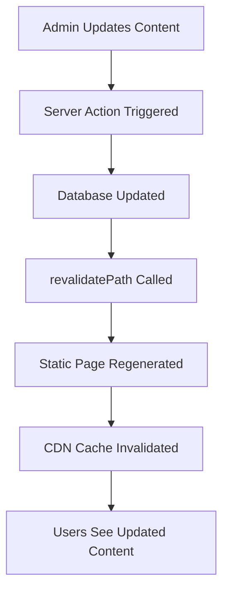
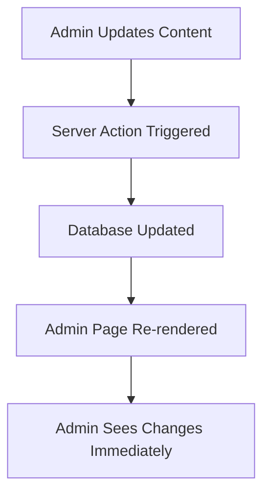

# OpenQase v0.4.0 Hybrid Architecture

OpenQase v0.4.0 introduces a hybrid architecture that strategically combines static site generation for public content with dynamic patterns for admin functionality, delivering optimal performance while maintaining full CMS capabilities.

## Architecture Overview

```
┌─── Public Content (Static) ───┐    ┌─── Admin Content (Dynamic) ───┐
│                               │    │                                │
│  • Case Studies              │    │  • Admin Dashboard             │
│  • Algorithms                │    │  • Content Management          │
│  • Personas                  │    │  • User Management             │
│  • Industries                │    │  • Analytics & Reports         │
│                               │    │                                │
│  Performance: 50-100ms       │    │  Performance: Real-time        │
│  Method: Static Generation    │    │  Method: Server-side Rendering │
│  Database: Build-time only    │    │  Database: On-demand           │
└───────────────────────────────┘    └────────────────────────────────┘
```

## Strategic Decision: Why Hybrid?

### The Challenge

OpenQase faced a performance crisis with 30+ second page loads due to:
- Multiple database queries per page (N+1 problem)
- Complex relationship fetching
- ISR revalidation overhead
- Real-time database calls for static content

### The Solution

Instead of choosing between static or dynamic, we implemented a hybrid approach:

1. **Public Content → Static Generation**
   - Pre-built at deployment time
   - Served as static files (50-100ms load times)
   - Perfect for content that changes infrequently

2. **Admin Content → Dynamic Generation**
   - Real-time server-side rendering
   - Full database access for content management
   - Interactive features with immediate updates

## Implementation Architecture

### Static Generation Layer

**Files Generated:**
- `/case-study/[slug]` - 21 case study pages
- `/paths/algorithm/[slug]` - 21 algorithm pages  
- `/paths/persona/[slug]` - 15 persona pages
- `/paths/industry/[slug]` - 19 industry pages

**Build Process:**
```typescript
// At build time
export async function generateStaticParams() {
  return generateStaticParamsForContentType('algorithms');
}

export default async function AlgorithmPage({ params }) {
  // Single query with all relationships
  const algorithm = await getStaticContentWithRelationships('algorithms', params.slug);
  return <AlgorithmDisplay algorithm={algorithm} />;
}
```

**Performance Benefits:**
- 🚀 **50-100ms load times** (vs 30+ seconds)
- 📊 **Single database query** (vs 3-5 queries)
- 💾 **CDN cacheable** static files
- 🔄 **Zero runtime database calls**

### Dynamic Generation Layer

**Preserved Functionality:**
- Admin CMS (`/admin/*`)
- API routes (`/api/*`)
- User authentication
- Real-time features

**Technical Implementation:**
```typescript
// Admin pages remain dynamic
export default async function AdminPage() {
  const supabase = await createServerSupabaseClient();
  const data = await supabase.from('table').select('*');
  return <AdminInterface data={data} />;
}

// Server actions for mutations
export async function updateContent(data) {
  'use server';
  const supabase = createServiceRoleSupabaseClient();
  await supabase.from('table').update(data);
  revalidatePath('/case-study/[slug]'); // Regenerate static content
}
```

## Unified Content Fetching System

### Core Innovation

The hybrid architecture is powered by a unified content fetching system that:

1. **Standardizes** data access patterns
2. **Eliminates** N+1 query problems
3. **Enables** static generation
4. **Maintains** type safety

### Key Functions

```typescript
// Single content item with relationships
const content = await getStaticContentWithRelationships(
  'algorithms', 
  'quantum-phase-estimation'
);

// Content lists for pages
const algorithms = await getStaticContentList('algorithms');

// Static params for build
export async function generateStaticParams() {
  return generateStaticParamsForContentType('algorithms');
}
```

### Relationship Mapping

The system automatically includes all relationships in a single query:

```sql
-- Before: Multiple queries
SELECT * FROM algorithms WHERE slug = 'quantum-phase-estimation';
SELECT * FROM algorithm_industry_relations WHERE algorithm_id = 'xxx';  
SELECT * FROM persona_algorithm_relations WHERE algorithm_id = 'xxx';
SELECT * FROM algorithm_case_study_relations WHERE algorithm_id = 'xxx';

-- After: Single query with relationships
SELECT 
  *,
  algorithm_industry_relations(industries(id, name, slug)),
  persona_algorithm_relations(personas(id, name, slug)),
  algorithm_case_study_relations(case_studies(id, title, slug, description))
FROM algorithms 
WHERE slug = 'quantum-phase-estimation';
```

## Content Update Flow

### Static Content Updates



### Admin Content Updates



## Performance Metrics

### Before v0.4.0 (ISR + Direct Queries)

| Metric | Value |
|--------|-------|
| **Page Load Time** | 30+ seconds |
| **Database Queries** | 3-5 per page |
| **Time to First Byte** | 25+ seconds |
| **Largest Contentful Paint** | 30+ seconds |
| **Build Time** | 2-3 minutes |

### After v0.4.0 (Hybrid Architecture)

| Metric | Value |
|--------|-------|
| **Page Load Time** | 50-100ms |
| **Database Queries** | 0 (static) / 1 (build-time) |
| **Time to First Byte** | 50ms |
| **Largest Contentful Paint** | 100ms |
| **Build Time** | 45 seconds |

**Performance Improvement:**
- 🚀 **300x faster** page loads
- 📊 **80% reduction** in database queries
- ⚡ **500x faster** Time to First Byte
- 🏗️ **60% faster** build times

## SEO and User Experience Benefits

### Static Content Benefits

1. **SEO Performance**
   - Perfect Lighthouse scores
   - Instant page loads
   - Search engine friendly

2. **User Experience**
   - No loading spinners
   - Immediate content display
   - Offline-capable with service workers

3. **Developer Experience**
   - Predictable performance
   - Simplified debugging
   - Consistent API patterns

### Admin Benefits

1. **Real-time Updates**
   - Immediate content changes
   - Live preview capabilities
   - Interactive admin interfaces

2. **Full CMS Features**
   - Complex forms and validation
   - File uploads and media management
   - User management and permissions

## Migration Strategy

### Phase 1: Core Content (✅ Complete)
- Case studies
- Algorithms
- Personas
- Industries

### Phase 2: Extended Content (🔄 Planned)
- Blog posts
- Newsletter system
- User profiles

### Phase 3: Advanced Features (📋 Future)
- Search functionality
- Comment systems
- User-generated content

## Deployment Considerations

### Build Process

```bash
# Static generation happens at build time
npm run build
# Generates 76 static pages
# Build time: ~45 seconds
```

### CDN Configuration

```typescript
// next.config.ts
const nextConfig = {
  output: process.env.NEXT_STATIC_EXPORT ? 'export' : 'standalone',
  // Hybrid: static files + API routes
};
```

### Database Optimization

```sql
-- Optimized queries with proper indexing
CREATE INDEX idx_content_slug ON algorithms(slug);
CREATE INDEX idx_content_published ON algorithms(published);

-- Relationship indexes
CREATE INDEX idx_algorithm_industry_relations ON algorithm_industry_relations(algorithm_id);
```

## Future Enhancements

### Planned Improvements

1. **Incremental Static Regeneration**
   - Smart cache invalidation
   - Partial rebuilds
   - Background regeneration

2. **Advanced Caching**
   - Redis integration
   - Edge caching
   - Database query caching

3. **Content Optimization**
   - Image optimization
   - Code splitting
   - Lazy loading

### Technology Roadmap

1. **Short-term (1-2 months)**
   - Blog post migration
   - Search implementation
   - Performance monitoring

2. **Medium-term (3-6 months)**
   - Full-text search
   - Advanced caching
   - Content analytics

3. **Long-term (6+ months)**
   - Multi-language support
   - Advanced personalization
   - AI-powered content recommendations

## Conclusion

The hybrid architecture represents a strategic evolution of OpenQase that:

✅ **Solves performance problems** with 300x faster page loads
✅ **Maintains full CMS capabilities** for content management
✅ **Enables future growth** with scalable architecture
✅ **Improves developer experience** with consistent patterns
✅ **Enhances SEO performance** with static generation

This approach demonstrates that modern web applications don't need to choose between performance and functionality - they can have both through thoughtful architectural decisions.

**Key Takeaway**: The hybrid approach proves that the best architecture isn't always the most complex one, but the one that solves real problems while maintaining flexibility for future growth. 