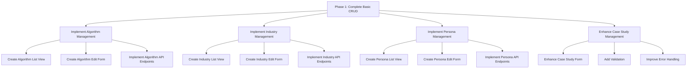
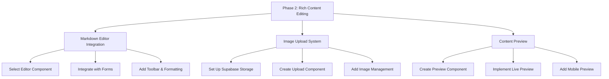
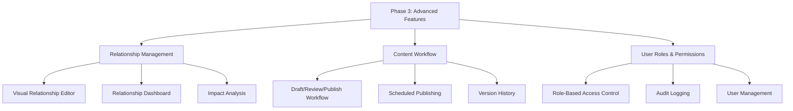

# OpenQASE CMS Implementation Plan

## Overview

This document outlines the plan for implementing a comprehensive Content Management System (CMS) for OpenQASE. The CMS will enable administrators to create, edit, and manage various content types including case studies, algorithms, industries, and personas.

## Current State Analysis

### What's Already in Place

1. **Database Structure**:
   - Well-defined tables for case studies, algorithms, industries, and personas
   - Appropriate relationships between content types
   - Row-level security policies for data protection

2. **API Endpoints**:
   - Basic CRUD endpoints for case studies
   - GET endpoints for algorithms, industries, and personas
   - Authentication integration with Supabase

3. **Admin UI**:
   - Basic admin dashboard with navigation to different content types
   - Case studies listing page with basic functionality
   - Case study edit form with tabs for different sections

### What's Missing

1. **Complete CRUD Operations**:
   - Missing POST/PUT/DELETE endpoints for algorithms, industries, and personas
   - Incomplete form handling for content creation/editing

2. **Rich Content Editing**:
   - No markdown editor for content creation
   - Limited preview capabilities
   - No image upload functionality

3. **Relationship Management**:
   - Limited UI for managing relationships between content types
   - No visualization of content relationships

4. **Admin Features**:
   - No content validation
   - No draft/publish workflow
   - No audit logging
   - Limited user role management

## CMS Development Plan

### Phase 1: Complete Basic CRUD for All Content Types



#### 1. Algorithm Management

1. **Create Algorithm List View**:
   - Implement a data table similar to case studies
   - Add sorting, filtering, and pagination
   - Include status indicators (published/draft)

2. **Create Algorithm Edit Form**:
   - Basic information (name, slug, description)
   - Technical details (complexity, prerequisites)
   - Relationship management (related case studies, industries)

3. **Implement Algorithm API Endpoints**:
   - Complete POST/PUT/DELETE endpoints
   - Add validation
   - Handle relationships

#### 2. Industry Management

1. **Create Industry List View**:
   - Data table with sorting and filtering
   - Status indicators
   - Action buttons (edit, delete, view)

2. **Create Industry Edit Form**:
   - Basic information (name, slug, description)
   - Icon selection
   - Relationship management (related case studies, algorithms)

3. **Implement Industry API Endpoints**:
   - Complete POST/PUT/DELETE endpoints
   - Add validation
   - Handle relationships

#### 3. Persona Management

1. **Create Persona List View**:
   - Data table with sorting and filtering
   - Technical level indicators
   - Action buttons

2. **Create Persona Edit Form**:
   - Basic information (name, slug, description)
   - Role and technical level selection
   - Industry focus and key interests
   - Relationship management

3. **Implement Persona API Endpoints**:
   - Complete POST/PUT/DELETE endpoints
   - Add validation
   - Handle relationships

#### 4. Enhance Case Study Management

1. **Improve Case Study Form**:
   - Add validation for required fields
   - Improve relationship selection UI
   - Add better error handling and feedback

2. **Add Bulk Operations**:
   - Implement bulk publish/unpublish
   - Add bulk tagging
   - Enable bulk deletion with confirmation

### Phase 2: Rich Content Editing



#### 1. Markdown Editor Integration

1. **Select and Integrate Editor**:
   - Evaluate options (TipTap, MDX Editor, etc.)
   - Integrate with your form system
   - Ensure it works with your existing content

2. **Customize Editor Features**:
   - Add toolbar with formatting options
   - Support for code blocks with syntax highlighting
   - Support for tables and other complex elements

3. **Add MDX Support**:
   - Enable custom components in content
   - Add component picker
   - Create component preview

#### 2. Image Upload System

1. **Set Up Supabase Storage**:
   - Configure buckets and permissions
   - Set up RLS policies
   - Create helper functions for uploads

2. **Create Upload Component**:
   - Drag-and-drop interface
   - Progress indicators
   - Error handling

3. **Add Image Management**:
   - Gallery view of uploaded images
   - Image selection for content
   - Image optimization

#### 3. Content Preview

1. **Create Preview Component**:
   - Render markdown/MDX content
   - Match frontend styling
   - Toggle between edit and preview

2. **Implement Live Preview**:
   - Side-by-side editing and preview
   - Real-time updates
   - Responsive preview

### Phase 3: Relationship Management and Advanced Features



#### 1. Relationship Management

1. **Visual Relationship Editor**:
   - Interactive UI for managing relationships
   - Drag-and-drop interface
   - Visualization of connections

2. **Relationship Dashboard**:
   - Overview of content relationships
   - Identify orphaned content
   - Suggest potential relationships

3. **Impact Analysis**:
   - Show impact of changes on related content
   - Warn about breaking changes
   - Provide suggestions for updates

#### 2. Content Workflow

1. **Draft/Review/Publish Workflow**:
   - Status tracking for content
   - Review process
   - Approval workflow

2. **Scheduled Publishing**:
   - Set future publish dates
   - Manage scheduled content
   - Notifications for publishing events

3. **Version History**:
   - Track changes to content
   - Compare versions
   - Restore previous versions

#### 3. User Roles and Permissions

1. **Role-Based Access Control**:
   - Define roles (admin, editor, viewer)
   - Set permissions per content type
   - Granular access control

2. **Audit Logging**:
   - Track all content changes
   - User activity monitoring
   - Export audit logs

3. **User Management**:
   - Invite new users
   - Assign roles
   - Manage permissions

## Technical Implementation Details

### Database Enhancements

1. **Add Workflow Fields to Content Tables**:
```sql
ALTER TABLE case_studies ADD COLUMN status TEXT DEFAULT 'draft';
ALTER TABLE case_studies ADD COLUMN review_notes TEXT;
ALTER TABLE case_studies ADD COLUMN scheduled_publish_at TIMESTAMP WITH TIME ZONE;
ALTER TABLE case_studies ADD COLUMN last_modified_by UUID REFERENCES auth.users(id);
```

2. **Create Version History Tables**:
```sql
CREATE TABLE content_versions (
  id UUID PRIMARY KEY DEFAULT uuid_generate_v4(),
  content_type TEXT NOT NULL,
  content_id UUID NOT NULL,
  version_number INTEGER NOT NULL,
  content JSONB NOT NULL,
  created_by UUID REFERENCES auth.users(id),
  created_at TIMESTAMP WITH TIME ZONE DEFAULT NOW(),
  UNIQUE(content_type, content_id, version_number)
);
```

3. **Add Audit Logging**:
```sql
CREATE TABLE audit_logs (
  id UUID PRIMARY KEY DEFAULT uuid_generate_v4(),
  user_id UUID REFERENCES auth.users(id),
  action TEXT NOT NULL,
  resource_type TEXT NOT NULL,
  resource_id UUID NOT NULL,
  details JSONB,
  created_at TIMESTAMP WITH TIME ZONE DEFAULT NOW()
);
```

### Frontend Components

1. **Shared Form Components**:
   - Create reusable form components for all content types
   - Implement validation patterns
   - Add error handling and loading states

2. **Rich Text Editor**:
   - Integrate TipTap or similar editor
   - Add custom extensions for quantum-specific content
   - Create toolbar with formatting options

3. **Relationship Management UI**:
   - Create multi-select components with search
   - Add visual relationship editor
   - Implement drag-and-drop interface

4. **Dashboard Components**:
   - Create overview dashboard with content metrics
   - Add recent activity feed
   - Implement content status widgets

### API Enhancements

1. **Complete CRUD Endpoints**:
   - Implement missing endpoints for all content types
   - Add validation middleware
   - Implement error handling

2. **Workflow API**:
   - Add endpoints for status changes
   - Implement review process
   - Add scheduled publishing

3. **Search and Discovery**:
   - Implement full-text search
   - Add advanced filtering
   - Create recommendation endpoints

## Implementation Roadmap

### Week 1-2: Complete Basic CRUD

- Set up algorithm, industry, and persona management
- Enhance case study management
- Implement missing API endpoints
- Add basic validation

### Week 3-4: Rich Content Editing

- Integrate markdown editor
- Set up image upload system
- Implement content preview
- Add MDX support

### Week 5-6: Relationship Management

- Create relationship UI components
- Implement visual relationship editor
- Add relationship dashboard
- Implement impact analysis

### Week 7-8: Advanced Features

- Add workflow features
- Implement version history
- Set up user roles and permissions
- Add audit logging

## Integration with Existing Codebase

The implementation will build upon the existing foundation:

1. **Admin Layout**:
   - Extend the current admin layout with additional navigation
   - Maintain consistent styling and UI patterns

2. **API Structure**:
   - Follow the pattern established in the case studies API
   - Maintain consistent error handling and response formats

3. **Database Access**:
   - Use the existing Supabase client setup
   - Follow established patterns for data access and manipulation

4. **Authentication**:
   - Leverage the existing authentication system
   - Extend with role-based permissions

## Conclusion

This CMS implementation plan provides a structured approach to building a comprehensive content management system for OpenQASE. By following this plan, we can create a robust system that enables efficient management of all content types while maintaining consistency with the existing codebase and technology stack.

The phased approach allows for incremental development and testing, ensuring that each component is properly implemented before moving on to more advanced features. This will result in a more stable and maintainable system.