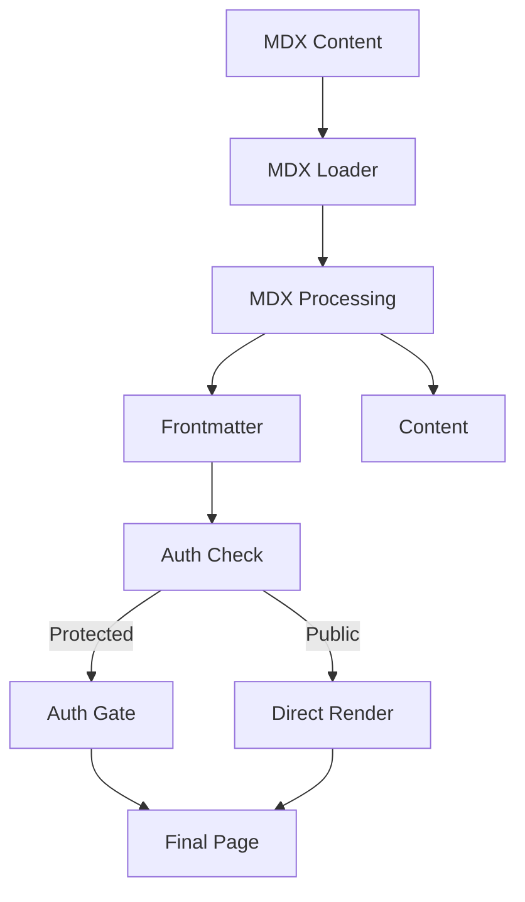

# OpenQase Content Management Guide

## Overview

This guide explains how to create and manage content in OpenQase, including handling protected content and authentication requirements.

## Content Types and Access Levels

### Public Content
- Landing page content
- About page content
- Public documentation

### Protected Content
- Learning paths
- Case studies
- Quantum stack documentation
- User-specific content

## Content Creation

### Directory Structure

Content is organized in the `/content` directory:
```
content/
├── algorithm/      # Quantum algorithms (protected)
├── case-study/     # Implementation examples (protected)
├── industry/       # Industry applications (protected)
└── persona/        # Role-based learning paths (protected)
```

### Creating MDX Files

Each content type follows a specific structure with required frontmatter fields. Here are the templates for each type:

#### 1. Algorithm Content (Protected)
```mdx
---
title: "Algorithm Name"
type: "algorithm"
slug: "unique-slug"
description: "Brief description"
keyApplications: ["application1", "application2"]
prerequisites: ["prerequisite1", "prerequisite2"]
keywords: ["keyword1", "keyword2"]
lastUpdated: "2024-02-23"
isProtected: true
authMessage: "Access quantum algorithm details and implementations"
---

# Content here...
```

#### 2. Case Study Content (Protected)
```mdx
---
title: "Case Study Name"
type: "case-study"
slug: "unique-slug"
description: "Brief description"
industry: ["industry-slug-1"]
technologies: ["tech1", "tech2"]
metrics: {
  "metric1": "value1",
  "metric2": "value2"
}
keywords: ["keyword1", "keyword2"]
lastUpdated: "2024-02-23"
isProtected: true
authMessage: "Unlock detailed case study insights"
---

# Content here...
```

#### 3. Industry Content (Protected)
```mdx
---
title: "Industry Name"
type: "industry"
slug: "unique-slug"
description: "Brief description"
sector: "sector-name"
keyApplications: ["application1", "application2"]
keywords: ["keyword1", "keyword2"]
lastUpdated: "2024-02-23"
isProtected: true
authMessage: "Access industry-specific quantum applications"
---

# Content here...
```

#### 4. Persona Content (Protected)
```mdx
---
title: "Persona Name"
type: "persona"
slug: "unique-slug"
description: "Brief description"
role: "Role Name"
expertise: ["skill1", "skill2"]
keywords: ["keyword1", "keyword2"]
lastUpdated: "2024-02-23"
isProtected: true
authMessage: "View role-specific learning paths"
---

# Content here...
```

## Content Processing and Rendering

### Build Time Processing

1. **Content Loading**
   - Next.js App Router handles content loading
   - Uses next-mdx-remote for MDX processing
   - Parses frontmatter with gray-matter
   - Validates protection status

2. **Authentication Integration**
   - Checks `isProtected` flag in frontmatter
   - Wraps protected content with `AuthGate`
   - Uses custom auth messages per content
   - Handles redirects for unauthenticated users



### Runtime Rendering

The application uses Next.js App Router with authentication:

1. **Protected Routes**
   - Uses `AuthGate` component for protection
   - Shows friendly warning messages
   - Handles auth state and redirects
   - Example:
     ```tsx
     <AuthGate
       title="Access Learning Path"
       description={content.frontmatter.authMessage}
     >
       {/* Protected content */}
     </AuthGate>
     ```

2. **Content Relationships**
   - Links between related content
   - Cross-references between types
   - Navigation between sections
   - Auth-aware navigation

## Component Usage

### 1. Protected Content Components
```tsx
// Example of a protected content section
<ProtectedSection
  title="Advanced Implementation"
  description="Access detailed implementation steps"
>
  {/* Protected content */}
</ProtectedSection>
```

### 2. Auth-Aware Navigation
```tsx
// Example of auth-aware navigation
<ContentNavigation
  next={nextContent}
  previous={prevContent}
  authRequired={content.isProtected}
/>
```

## Maintenance Tasks

1. **Adding New Content**
   - Create MDX file in appropriate directory
   - Include all required frontmatter
   - Set protection status and auth message
   - Add content body
   - Build and test locally

2. **Updating Content**
   - Update MDX file
   - Update lastUpdated date
   - Verify protection status
   - Test with and without auth

3. **Content Relationships**
   - Ensure referenced content exists
   - Update related content references
   - Check protection status consistency
   - Verify auth messages

## Best Practices

1. **Content Organization**
   - Use clear, descriptive titles
   - Maintain consistent formatting
   - Keep content focused and relevant
   - Use appropriate keywords
   - Properly mark protected content

2. **Authentication**
   - Always set `isProtected` flag appropriately
   - Provide clear auth messages
   - Test both authenticated and unauthenticated states
   - Use consistent warning messages
   - Handle loading states

3. **Frontmatter**
   - Include all required fields
   - Use consistent date format
   - Keep descriptions concise
   - Follow the type definitions
   - Set appropriate auth flags

4. **Content Body**
   - Use proper heading hierarchy
   - Include relevant examples
   - Add helpful diagrams/images
   - Maintain consistent style
   - Use auth-aware components
   - Consider progressive disclosure

5. **Development**
   - Test content locally
   - Verify auth flows
   - Follow TypeScript types
   - Use existing components
   - Keep code DRY
   - Follow accessibility guidelines

## Last Updated: 2024-03