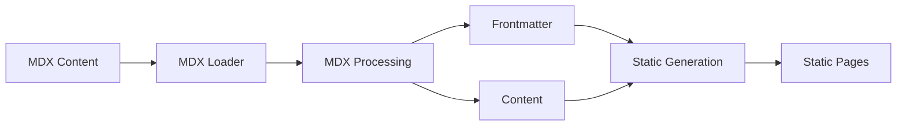

# OpenQase Content Management Guide

## Content Creation

### Directory Structure

Content is organized in the `/content` directory:
```
content/
├── algorithm/      # Quantum algorithms
├── case-study/     # Implementation examples
├── industry/       # Industry applications
└── persona/        # Role-based learning paths
```

### Creating MDX Files

Each content type follows a specific structure with required frontmatter fields. Here are the templates for each type:

#### 1. Algorithm Content
```mdx
---
title: "Algorithm Name"
type: "algorithm"
slug: "unique-slug"
description: "Brief description"
keyApplications: ["application1", "application2"]
prerequisites: ["prerequisite1", "prerequisite2"]
keywords: ["keyword1", "keyword2"]
lastUpdated: "2024-02-23"
---

# Content here...
```

#### 2. Case Study Content
```mdx
---
title: "Case Study Name"
type: "case-study"
slug: "unique-slug"
description: "Brief description"
industry: ["industry-slug-1"]
technologies: ["tech1", "tech2"]
metrics: {
  "metric1": "value1",
  "metric2": "value2"
}
keywords: ["keyword1", "keyword2"]
lastUpdated: "2024-02-23"
---

# Content here...
```

#### 3. Industry Content
```mdx
---
title: "Industry Name"
type: "industry"
slug: "unique-slug"
description: "Brief description"
sector: "sector-name"
keyApplications: ["application1", "application2"]
keywords: ["keyword1", "keyword2"]
lastUpdated: "2024-02-23"
---

# Content here...
```

#### 4. Persona Content
```mdx
---
title: "Persona Name"
type: "persona"
slug: "unique-slug"
description: "Brief description"
role: "Role Name"
expertise: ["skill1", "skill2"]
keywords: ["keyword1", "keyword2"]
lastUpdated: "2024-02-23"
---

# Content here...
```

## Content Processing and Rendering

### Build Time Processing

1. **Content Loading**
   - Next.js App Router handles content loading
   - Uses next-mdx-remote for MDX processing
   - Parses frontmatter with gray-matter
   - Returns typed content with frontmatter separation

2. **Static Generation**
   - Next.js generates static pages
   - Creates dynamic routes based on content
   - Builds relationship links
   - Optimizes for performance



### Runtime Rendering

The application uses Next.js App Router for page rendering:

1. **Dynamic Routes**
   - `/app/paths/[content-type]/[slug]/page.tsx` handles individual content
   - Uses `generateStaticParams` for static paths
   - Renders MDX with custom components
   - Accesses data through frontmatter

2. **Content Relationships**
   - Links between related content
   - Cross-references between types
   - Navigation between sections

## Maintenance Tasks

1. **Adding New Content**
   - Create MDX file in appropriate directory
   - Include all required frontmatter
   - Add content body
   - Build and test locally

2. **Updating Content**
   - Update MDX file
   - Update lastUpdated date
   - Test locally

3. **Content Relationships**
   - Ensure referenced content exists
   - Update related content references
   - Check bidirectional links

## Best Practices

1. **Content Organization**
   - Use clear, descriptive titles
   - Maintain consistent formatting
   - Keep content focused and relevant
   - Use appropriate keywords

2. **Frontmatter**
   - Include all required fields
   - Use consistent date format
   - Keep descriptions concise
   - Follow the type definitions

3. **Content Body**
   - Use proper heading hierarchy
   - Include relevant examples
   - Add helpful diagrams/images
   - Maintain consistent style
   - Use custom components like Steps and Mermaid

4. **Development**
   - Test content locally
   - Follow TypeScript types
   - Use existing components
   - Keep code DRY
   - Follow accessibility guidelines