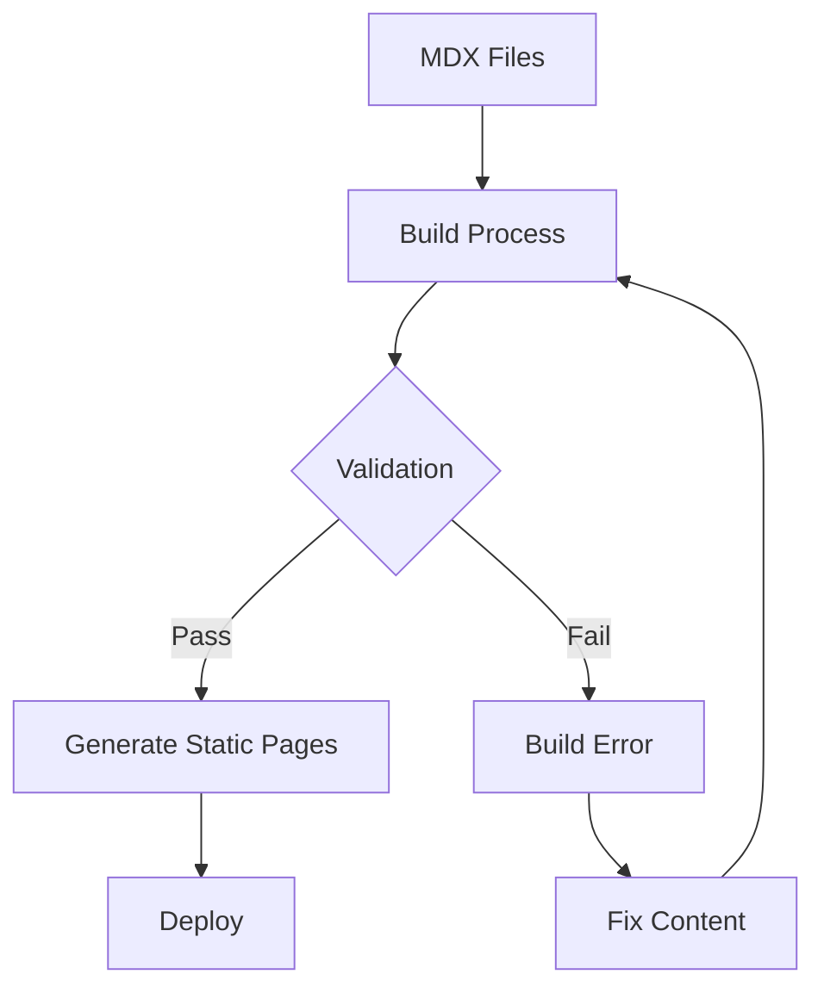
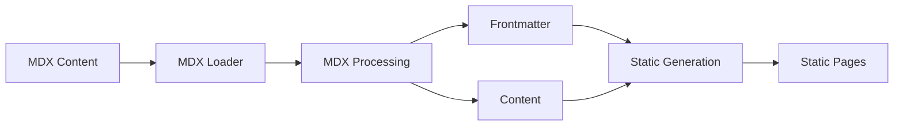
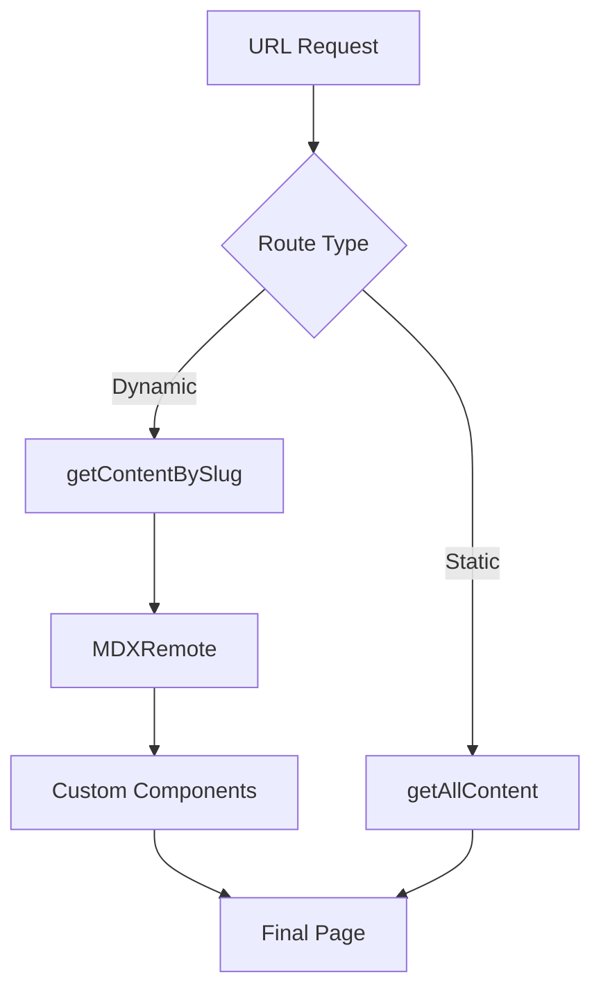

# OpenQASE Content Management Guide

## Content Creation

### Directory Structure

Content is organized in the `/content` directory:
```
content/
├── algorithm/      # Quantum algorithms
├── case-study/     # Implementation examples
├── industry/       # Industry applications
└── persona/        # Role-based learning paths
```

### Creating MDX Files

Each content type follows a specific structure with required frontmatter fields. Here are the templates for each type:

#### 1. Algorithm Content
```mdx
---
title: "Algorithm Name"
type: "algorithm"
slug: "unique-slug"
description: "Brief description"
complexity: "O(n²)"
applications: ["use-case-1", "use-case-2"]
prerequisites: ["prerequisite-1", "prerequisite-2"]
relatedCaseStudies: ["case-study-slug-1"]
keywords: ["keyword1", "keyword2"]
lastUpdated: "2024-02-23"
---

# Content here...
```

#### 2. Case Study Content
```mdx
---
title: "Case Study Name"
type: "case-study"
slug: "unique-slug"
description: "Brief description"
difficulty: "Beginner" | "Intermediate" | "Advanced"
persona: ["persona-slug-1"]
industry: ["industry-slug-1"]
algorithm: ["algorithm-slug-1"]
metrics: {
  "metric1": "value1",
  "metric2": "value2"
}
technologies: ["tech1", "tech2"]
tags: ["tag1", "tag2"]
createdAt: "2024-02-23"
updatedAt: "2024-02-23"
lastUpdated: "2024-02-23"
---

# Content here...
```

#### 3. Industry Content
```mdx
---
title: "Industry Name"
type: "industry"
slug: "unique-slug"
description: "Brief description"
sector: "sector-name"
keyApplications: [
  {
    title: "Application 1",
    description: "Description",
    examples: ["example1", "example2"]
  }
]
relatedCaseStudies: ["case-study-slug-1"]
color: "blue"
layer: 1
applications: [
  {
    title: "Application 2",
    description: "Description",
    examples: ["example3", "example4"]
  }
]
relatedContent: {
  algorithm: ["algorithm-slug-1"],
  caseStudy: ["case-study-slug-1"]
}
lastUpdated: "2024-02-23"
---

# Content here...
```

#### 4. Persona Content
```mdx
---
title: "Persona Name"
type: "persona"
slug: "unique-slug"
description: "Brief description"
role: "Role Name"
expertise: ["skill1", "skill2"]
relatedCaseStudies: ["case-study-slug-1"]
keywords: ["keyword1", "keyword2"]
personaType: "Technical" | "Persona"
lastUpdated: "2024-02-23"
---

# Content here...
```

## Content Validation

The application validates content in two ways:

1. **Build-time Validation**
   - Runs during `npm run build`
   - Checks all required fields
   - Verifies relationships between content
   - Ensures proper formatting

2. **Runtime Validation**
   - Type checking of content
   - Relationship verification
   - Dynamic route generation

### Validation Process



## Content Processing and Rendering

### Build Time Processing

1. **Content Loading**
   - `lib/mdx.ts` reads MDX files
   - Processes MDX with plugins (remarkGfm, rehypePrismPlus)
   - Parses frontmatter with gray-matter
   - Validates content structure
   - Returns typed content with frontmatter separation

2. **Static Generation**
   - Next.js generates static pages
   - Creates dynamic routes based on content
   - Builds relationship links
   - Optimizes for performance



### Runtime Rendering

The application uses Next.js App Router for page rendering:

1. **Dynamic Routes**
   - `/app/paths/[content-type]/[slug]/page.tsx` handles individual content
   - Uses `generateStaticParams` for static paths
   - Renders MDX with custom components
   - Accesses data through frontmatter

2. **Content Relationships**
   - Links between related content
   - Cross-references between types
   - Navigation between sections



## API Routes

The application includes API routes for admin functionality:

- `/api/admin/algorithm` - Manage algorithm content
- `/api/admin/case-study` - Manage case studies
- `/api/admin/industry` - Manage industry content

These routes are used by the admin interface for content management.

## Maintenance Tasks

1. **Adding New Content**
   - Create MDX file in appropriate directory
   - Include all required frontmatter
   - Add content body
   - Run validation (`npm run validate`)
   - Build and test locally

2. **Updating Content**
   - Update MDX file
   - Update lastUpdated date
   - Validate relationships
   - Test locally

3. **Content Relationships**
   - Ensure referenced content exists
   - Update related content references
   - Check bidirectional links

## Best Practices

1. **Content Organization**
   - Use clear, descriptive titles
   - Maintain consistent formatting
   - Keep content focused and relevant
   - Use appropriate tags and categories

2. **Frontmatter**
   - Include all required fields
   - Use consistent date format
   - Verify relationships exist
   - Keep descriptions concise
   - Always access through frontmatter in components

3. **Content Body**
   - Use proper heading hierarchy
   - Include relevant examples
   - Add helpful diagrams/images
   - Maintain consistent style

4. **Development**
   - Test content locally
   - Validate before committing
   - Review generated pages
   - Check relationships work
   - Always use getContentBySlug/getAllContent from lib/mdx.ts