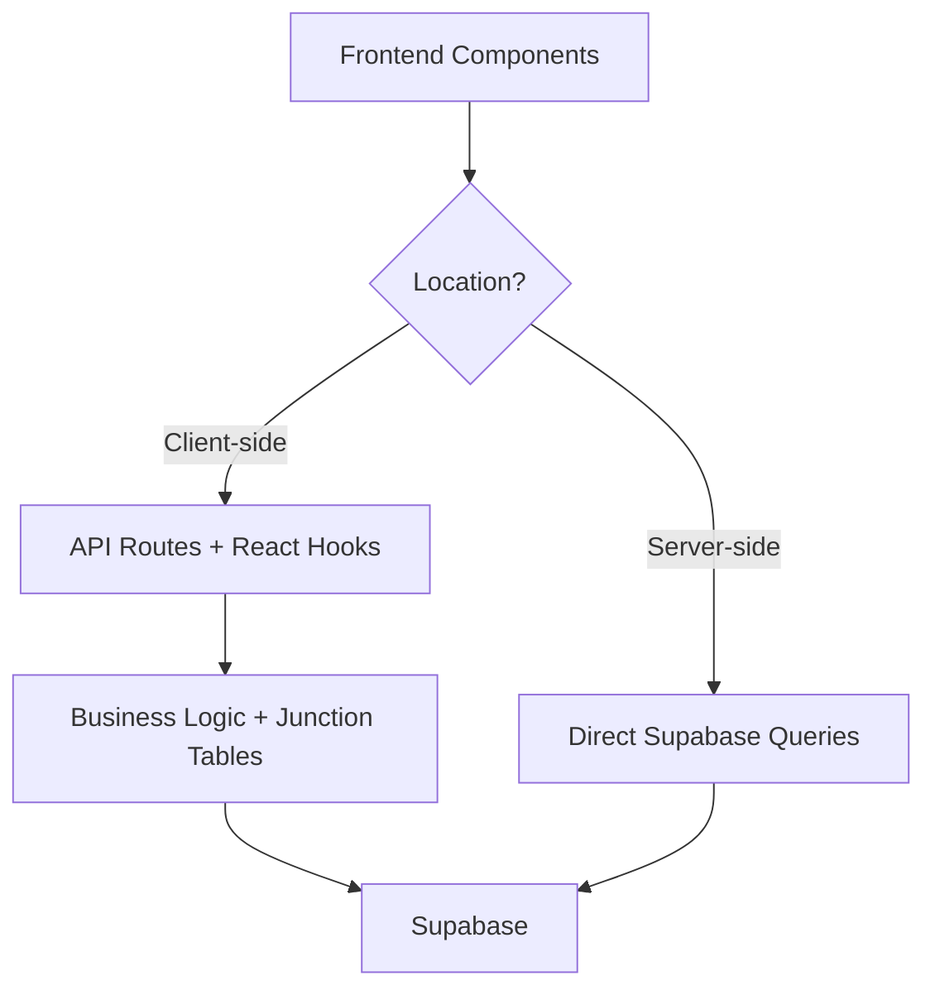

# API Documentation

OpenQase uses a **unified API architecture** designed for optimal performance and consistency. This guide explains how to fetch and manage data effectively.

## Architecture Overview

Our API uses a **single, consistent approach**:

1. **Server-side pages** - Direct Supabase queries for maximum performance
2. **Client-side operations** - API routes for complex operations and business logic
3. **React hooks** - Simplified hooks for common client-side data fetching



## Data Access Patterns

### ✅ Server-side Pages (Recommended)
Use direct Supabase queries for:
- **Individual content pages** (`/algorithm/[slug]`, `/case-study/[slug]`, etc.)
- **Admin pages** with immediate data needs
- **Static generation** and **server-side rendering**

**Benefits:**
- Fastest possible performance (direct database access)
- Automatic caching and optimization
- SEO-friendly

**Example:**
```typescript
// app/algorithm/[slug]/page.tsx
import { createServerSupabaseClient } from '@/lib/supabase-server';

export default async function AlgorithmPage({ params }) {
  const supabase = await createServerSupabaseClient();
  
  const { data: algorithm } = await supabase
    .from('algorithms')
    .select(`
      *,
      algorithm_industry_relations(industries(id, name, slug)),
      persona_algorithm_relations(personas(id, name, slug))
    `)
    .eq('slug', params.slug)
    .single();

  return <div>{algorithm.name}</div>;
}
```

### ✅ Client-side Operations
Use API routes for:
- **Complex filtering** with junction tables
- **Admin operations** (create, update, delete)
- **Form submissions** and **user interactions**
- **Data that needs real-time updates**

**Available React Hooks:**
```typescript
// Case studies with filtering
const { data } = useCaseStudies(1, 10, { industry: 'aerospace' });

// Single case study
const { data } = useCaseStudy('ibm-boeing-aerospace');

// Newsletter subscription
const subscribe = useNewsletterSubscription();
```

## API Routes Reference

### Case Studies API

**Get case studies with filtering:**
```typescript
GET /api/case-studies?page=1&pageSize=10&industry=aerospace

// Response
{
  "items": [
    {
      "id": "uuid",
      "title": "IBM Boeing Aerospace",
      "slug": "ibm-boeing-aerospace",
      "related_industries": [
        { "id": "uuid", "name": "Aerospace", "slug": "aerospace" }
      ],
      "related_algorithms": [
        { "id": "uuid", "name": "VQE", "slug": "vqe" }
      ]
    }
  ],
  "pagination": {
    "page": 1,
    "pageSize": 10,
    "totalItems": 25,
    "totalPages": 3
  }
}
```

**Get single case study:**
```typescript
GET /api/case-studies/ibm-boeing-aerospace

// Response
{
  "id": "uuid",
  "title": "IBM Boeing Aerospace",
  "slug": "ibm-boeing-aerospace",
  "description": "...",
  "main_content": "...",
  "related_industries": [...],
  "related_algorithms": [...],
  "related_personas": [...]
}
```

### Admin Operations

**Create/Update case study:**
```typescript
POST /api/case-studies

{
  "title": "New Case Study",
  "slug": "new-case-study",
  "description": "Description...",
  "industries": ["industry-id-1", "industry-id-2"],
  "algorithms": ["algorithm-id-1"],
  "published": true
}
```

**Delete case study:**
```typescript
DELETE /api/case-studies?id=uuid
```

### Other API Routes

- `GET /api/algorithms` - List algorithms
- `GET /api/algorithms/[slug]` - Get single algorithm
- `POST /api/algorithms` - Create/update algorithm
- `GET /api/industries/[slug]` - Get single industry
- `POST /api/newsletter` - Subscribe to newsletter
- `POST /api/revalidate` - Revalidate cached pages

## Error Handling

### API Routes
```typescript
// Standard error responses
{
  "error": "Resource not found"
}

// Status codes: 400, 404, 500
```

### React Hooks
```typescript
const { data, isLoading, error } = useCaseStudies();

if (error) {
  return <div>Error: {error.message}</div>;
}

if (isLoading) {
  return <div>Loading...</div>;
}
```

### Server-side Queries
```typescript
const { data, error } = await supabase
  .from('case_studies')
  .select('*')
  .eq('slug', slug)
  .single();

if (error || !data) {
  return notFound();
}
```

## Best Practices

### ✅ Do's
- **Use server-side queries** for individual pages (fastest)
- **Use API routes** for complex operations
- **Use React hooks** for client-side data fetching
- **Handle loading and error states** in components
- **Use TypeScript** for better type safety

### ❌ Don'ts
- Don't mix server and client data fetching in the same component
- Don't forget to handle error states
- Don't bypass RLS (Row Level Security) policies

## Migration Guide

### If you have old code using ApiClient:

**❌ Old (ApiClient):**
```typescript
import { ApiClient } from '@/lib/api-client';

const industries = await ApiClient.getIndustries();
const caseStudy = await ApiClient.getCaseStudyBySlug('slug');
```

**✅ New (Server-side):**
```typescript
import { createServerSupabaseClient } from '@/lib/supabase-server';

const supabase = await createServerSupabaseClient();
const { data: industries } = await supabase
  .from('industries')
  .select('*')
  .eq('published', true);

const { data: caseStudy } = await supabase
  .from('case_studies')
  .select('*')
  .eq('slug', 'slug')
  .single();
```

**✅ New (Client-side):**
```typescript
import { useCaseStudy } from '@/hooks/useApi';

const { data: caseStudy } = useCaseStudy('slug');
```

## Performance Characteristics

| Approach | Performance | Use Case |
|----------|-------------|----------|
| **Server-side Queries** | Fastest | Individual pages, static content |
| **API Routes** | Fast | Complex operations, admin |
| **React Hooks** | Good | Client-side interactions |

## Security

- **RLS Policies**: Automatically enforced for all data access
- **Admin Operations**: Use service role client for admin routes
- **Authentication**: Handled by Supabase Auth
- **CORS**: Configured for secure cross-origin requests

---

*This documentation reflects our unified API architecture. All examples use the current, supported patterns.* 