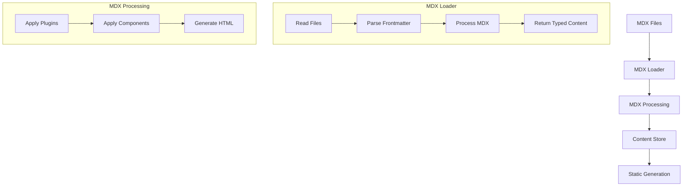
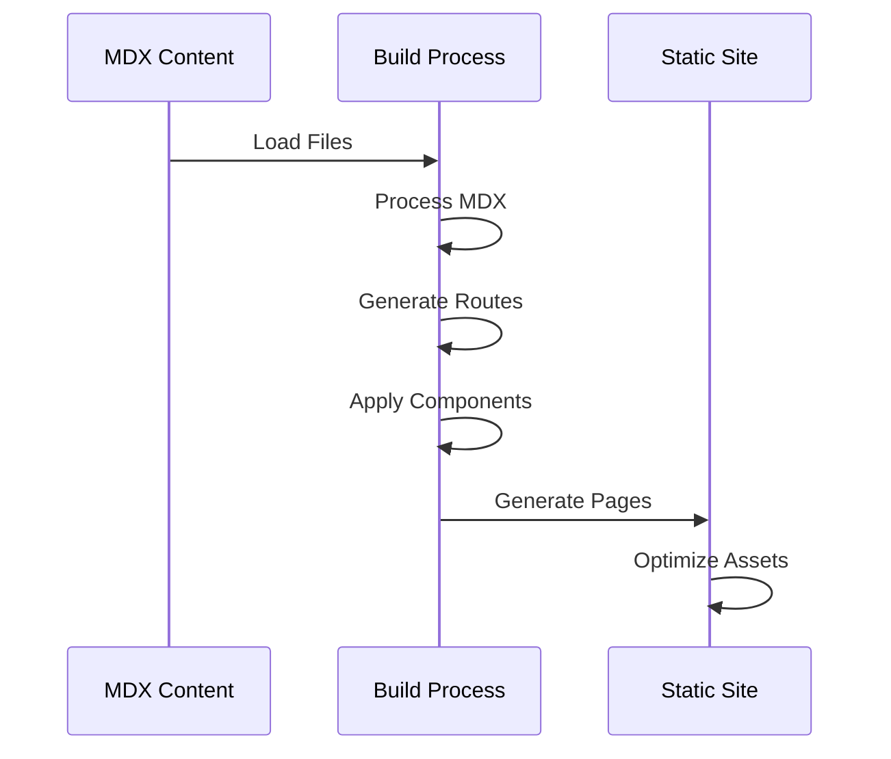
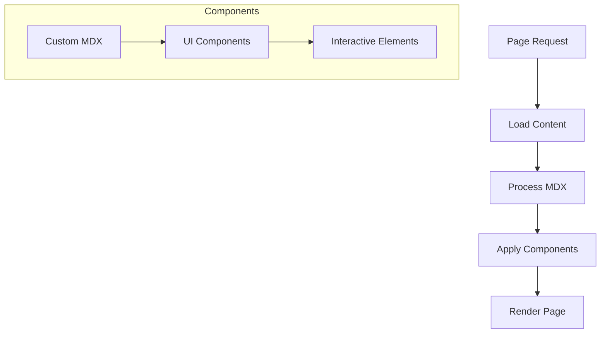
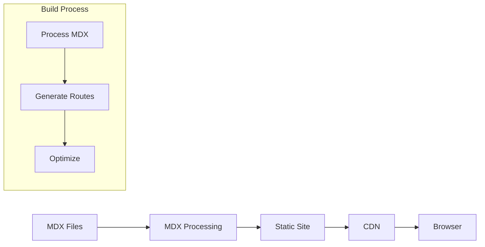

# OpenQASE Technical Architecture

## Overview

OpenQASE is a Next.js application that converts MDX content into a static educational platform. This document explains the technical implementation details.

## Core Components

### 1. Content Processing System



#### Implementation Details

1. **MDX Processing (`src/lib/mdx.ts`)**
   - Reads and processes MDX files
   - Uses gray-matter for frontmatter parsing
   - Applies MDX plugins (remarkGfm, rehypePrismPlus)
   - Returns typed content with frontmatter separation
   - Implements React cache for performance

```typescript
// src/lib/mdx.ts
export async function getContentBySlug<T>(
  type: ContentType,
  slug: string
): Promise<MDXContent<T>> {
  const { data, content } = matter(fileContents);
  const mdxSource = await serialize(content, {
    mdxOptions: {
      remarkPlugins: [remarkGfm],
      rehypePlugins: [rehypePrismPlus],
    },
    scope: data,
  });
  
  return {
    source: mdxSource,
    frontmatter: data as T,
    slug
  };
}
```

2. **Validation System (`src/lib/validation.ts`)**
   - Validates required fields
   - Checks content relationships
   - Ensures data integrity
   - Provides error reporting

### 2. Routing System

```mermaid
graph LR
    A[App Router] --> B{Route Types}
    B --> C[Dynamic Routes]
    B --> D[Static Routes]
    
    C --> E[/paths/[type]/[slug]]
    D --> F[/index]
    
    E --> G[Content Page]
    F --> H[Landing Page]
```

#### Route Implementation

1. **Dynamic Routes**
   - `/paths/[type]/[slug]/page.tsx` files
   - Generated from content at build time
   - Handle individual content pages
   - Include related content

2. **Static Routes**
   - Section landing pages
   - Content type indexes
   - Navigation pages
   - Search functionality

### 3. Build Process



#### Build Steps

1. **Content Processing**
   ```typescript
   // src/lib/mdx.ts
   export const getAllContent = cache(async <T>(
     type: ContentType
   ): Promise<MDXContent<T>[]> => {
     // Process all content of a type
     return contentList.sort((a, b) => {
       // Sort by date/title
     });
   });
   ```

2. **Route Generation**
   ```typescript
   // paths/[type]/[slug]/page.tsx
   export async function generateStaticParams() {
     const contentList = await getAllContent<ContentType>(type);
     return contentList.map(content => ({
       slug: content.slug
     }));
   }
   ```

3. **Page Generation**
   ```typescript
   // Example page component
   export default async function ContentPage({ params }) {
     const content = await getContentBySlug<ContentType>(params.type, params.slug);
     return (
       <article>
         <h1>{content.frontmatter.title}</h1>
         <MDXRemote source={content.source} components={components} />
       </article>
     );
   }
   ```

### 4. Content Rendering



#### Rendering Components

1. **MDX Components**
   - Custom heading styles
   - Code block highlighting
   - Interactive diagrams
   - Special content blocks

2. **Page Components**
   - Content layout
   - Navigation
   - Related content
   - Metadata display

### 5. Data Flow



## Development Workflow

### 1. Content Updates

1. Create/update MDX files
2. Run validation
3. Test locally
4. Build and deploy

### 2. Code Updates

1. Modify components/routes
2. Update MDX processing
3. Test with sample content
4. Validate build process

## Performance Considerations

1. **Build Optimization**
   - MDX processing with plugins
   - Efficient route generation
   - Asset optimization

2. **Runtime Performance**
   - Static page generation
   - Content caching
   - Optimized components

## Security

1. **Content Validation**
   - Strict frontmatter checking
   - Relationship validation
   - Format verification

2. **Build Process**
   - Secure MDX processing
   - Safe component rendering
   - Error handling

## Maintenance

1. **Content Updates**
   - Regular validation
   - Relationship checking
   - Performance monitoring

2. **Code Updates**
   - Component maintenance
   - Build process updates
   - Dependency management

## Next.js 15 Compatibility

### Dynamic Route Parameters

In Next.js 15, there was a significant change in how dynamic route parameters are handled. The `params` object in dynamic routes is now a Promise that needs to be awaited before accessing its properties.

#### Before Next.js 15
```typescript
// Old approach (pre-Next.js 15)
export default async function Page({ params }) {
  const { slug } = params; // Direct access
  // Use slug...
}
```

#### After Next.js 15
```typescript
// New approach (Next.js 15+)
export default async function Page({ params }) {
  const { slug } = await params; // Must await params
  // Use slug...
}
```

#### Type Definition
```typescript
interface PageProps {
  params: Promise<{
    slug: string;
    // other params...
  }>;
}
```

#### Common Error
If you see this error:
```
Error: Route "/path/[param]" used `params.param`. `params` should be awaited before using its properties.
```

It means you need to await the params object before accessing its properties.

#### Affected Routes
This change affects all dynamic routes in the application, including:
- `/blog/[slug]`
- `/paths/[type]/[slug]`
- Any other routes with dynamic parameters

For more information, see the [Next.js documentation](https://nextjs.org/docs/messages/sync-dynamic-apis).

## Future Considerations

1. **Scalability**
   - Content organization
   - Build performance
   - Caching strategies

2. **Features**
   - Enhanced validation
   - More interactive components
   - Advanced search