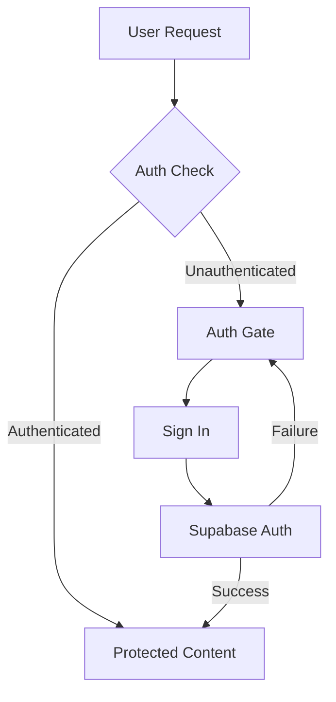
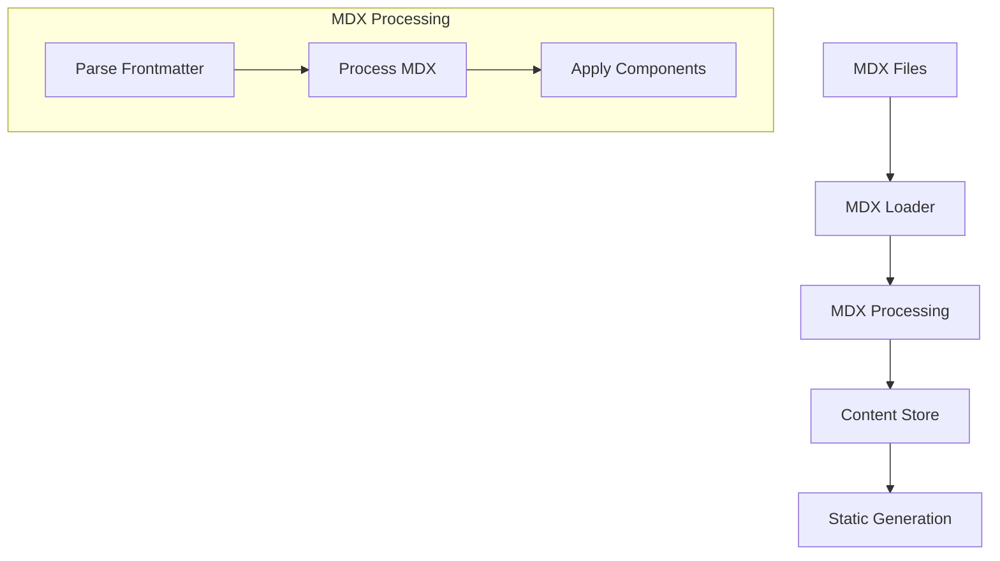
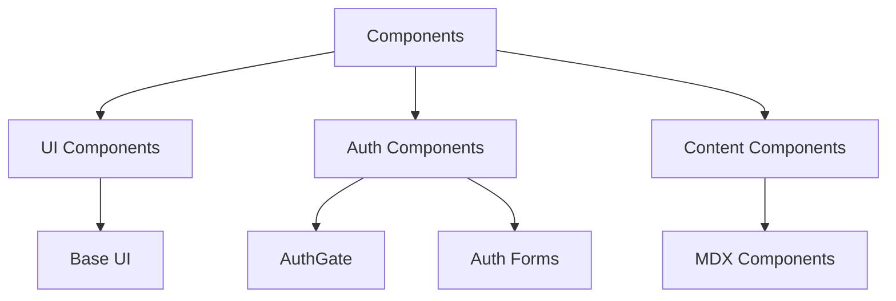
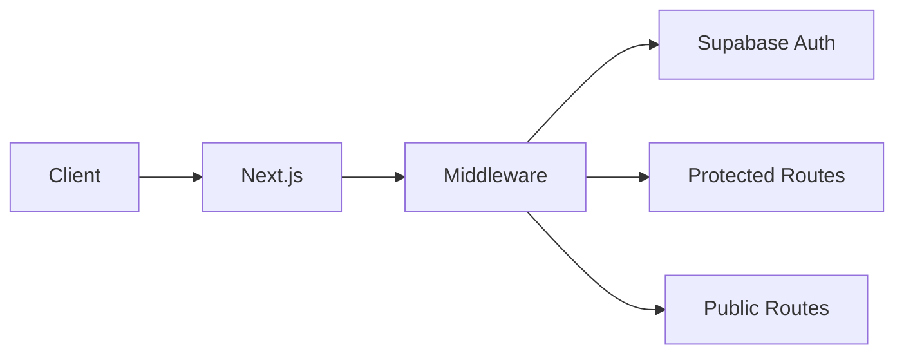

# OpenQASE Technical Architecture

## Overview

OpenQASE is a Next.js application that combines MDX content management with Supabase authentication to create a secure, educational platform. This document explains the technical implementation details.

## Core Components

### 1. Authentication System



#### Implementation Details

1. **Middleware (`src/middleware.ts`)**
   - Handles session validation
   - Manages protected routes
   - Handles auth callbacks
   ```typescript
   export async function middleware(req: NextRequest) {
     const res = NextResponse.next()
     const supabase = createMiddlewareClient({ req, res })
     const { data: { session } } = await supabase.auth.getSession()
     // Handle auth logic
     return res
   }
   ```

2. **AuthGate Component (`src/components/auth/AuthGate.tsx`)**
   - Client-side protection
   - Friendly warning messages
   - Handles auth state
   ```typescript
   export function AuthGate({ children, title, description }) {
     const [isAuthenticated, setIsAuthenticated] = useState<boolean>(false)
     // Auth gate implementation
     return isAuthenticated ? children : <WarningMessage />
   }
   ```

### 2. Content Processing System



#### Implementation Details

1. **MDX Processing (`src/lib/mdx.ts`)**
   - Reads and processes MDX files
   - Uses gray-matter for frontmatter
   - Applies MDX plugins
   ```typescript
   export async function getContentBySlug<T>(
     type: ContentType,
     slug: string
   ): Promise<MDXContent<T>> {
     // MDX processing implementation
   }
   ```

### 3. Routing System

```mermaid
graph LR
    A[App Router] --> B{Route Types}
    B --> C[Protected Routes]
    B --> D[Public Routes]
    
    C --> E[/paths/*]
    C --> F[/case-study/*]
    C --> G[/quantum-stack/*]
    
    D --> H[/]
    D --> I[/auth]
```

#### Route Implementation

1. **Protected Routes**
   - Require authentication
   - Use AuthGate component
   - Handle redirects
   ```typescript
   export default function ProtectedPage() {
     return (
       <AuthGate title="..." description="...">
         {/* Protected content */}
       </AuthGate>
     );
   }
   ```

2. **Public Routes**
   - Open access
   - Landing pages
   - Auth pages

### 4. Component System



#### Component Types

1. **UI Components**
   - Reusable base components
   - Styled with Tailwind
   - Accessible and responsive

2. **Auth Components**
   - Handle authentication flows
   - Manage auth state
   - Show auth gates

3. **Content Components**
   - MDX renderers
   - Content layouts
   - Interactive elements

### 5. Data Flow



## Security Considerations

1. **Authentication**
   - Secure session management
   - Protected route middleware
   - Client-side auth gates

2. **Environment Variables**
   - Supabase credentials
   - API keys
   - Environment-specific configs

3. **Route Protection**
   - Server-side checks
   - Client-side gates
   - Redirect handling

## Development Workflow

1. **Local Development**
   ```bash
   npm run dev
   # Environment setup
   cp .env.example .env.local
   # Update Supabase credentials
   ```

2. **Build Process**
   ```bash
   npm run build
   # Generates static pages
   # Processes MDX content
   # Optimizes assets
   ```

## Last Updated: 2024-03