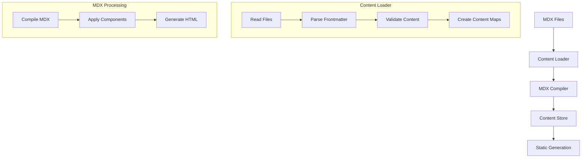
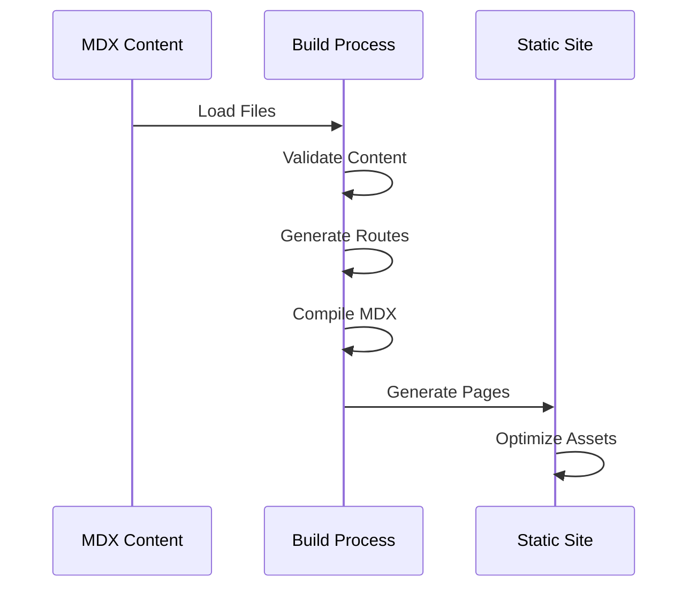
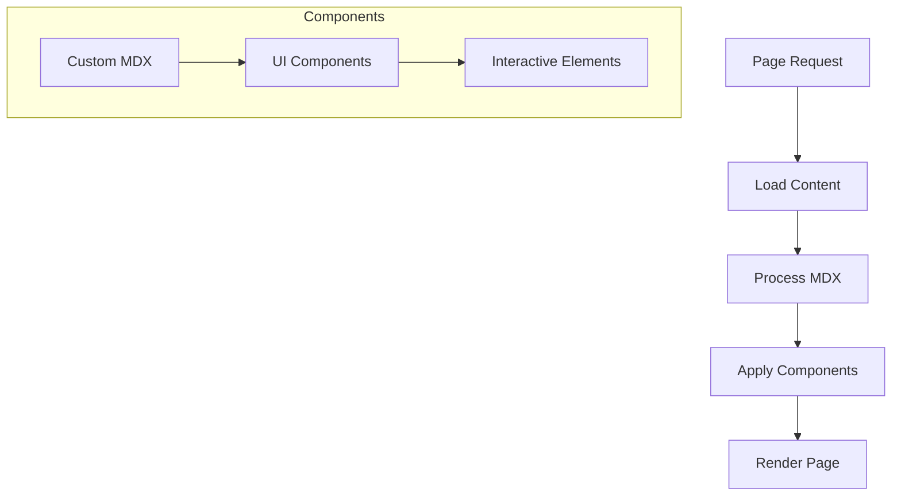
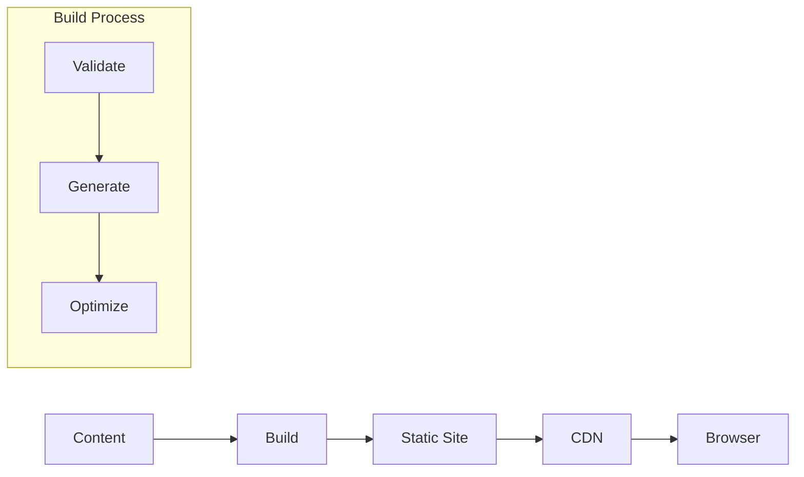

# OpenQASE Technical Architecture

## Overview

OpenQASE is a Next.js application that converts MDX content into a static educational platform. This document explains the technical implementation details.

## Core Components

### 1. Content Processing System



#### Implementation Details

1. **Content Loader (`content/loader.ts`)**
   - Reads MDX files from content directories
   - Uses gray-matter for frontmatter parsing
   - Implements React cache for performance
   - Creates type-safe content maps

2. **MDX Processing (`src/lib/mdx.ts`)**
   - Uses next-mdx-remote for compilation
   - Applies custom components
   - Handles markdown extensions
   - Processes code blocks

3. **Validation System (`src/lib/validation.ts`)**
   - Validates required fields
   - Checks content relationships
   - Ensures data integrity
   - Provides error reporting

### 2. Routing System

```mermaid
graph LR
    A[App Router] --> B{Route Types}
    B --> C[Dynamic Routes]
    B --> D[Static Routes]
    
    C --> E[/[type]/[slug]]
    D --> F[/index]
    
    E --> G[Content Page]
    F --> H[Landing Page]
```

#### Route Implementation

1. **Dynamic Routes**
   - `/[type]/[slug]/page.tsx` files
   - Generated from content at build time
   - Handle individual content pages
   - Include related content

2. **Static Routes**
   - Section landing pages
   - Content type indexes
   - Navigation pages
   - Search functionality

### 3. Build Process



#### Build Steps

1. **Content Processing**
   ```typescript
   // content/loader.ts
   export const loadContentByType = cache(async <T extends ContentType>(
     type: T
   ): Promise<Record<string, ContentTypeMap[T]>> => {
     // Load and process content
   });
   ```

2. **Route Generation**
   ```typescript
   // [type]/[slug]/page.tsx
   export async function generateStaticParams() {
     // Generate routes from content
   }
   ```

3. **Page Generation**
   ```typescript
   // Example page component
   export default async function ContentPage({ params }) {
     const content = await loadContentBySlug(params.type, params.slug);
     // Render content with components
   }
   ```

### 4. Content Rendering



#### Rendering Components

1. **MDX Components**
   - Custom heading styles
   - Code block highlighting
   - Interactive diagrams
   - Special content blocks

2. **Page Components**
   - Content layout
   - Navigation
   - Related content
   - Metadata display

### 5. Data Flow



## Development Workflow

### 1. Content Updates

1. Create/update MDX files
2. Run validation
3. Test locally
4. Build and deploy

### 2. Code Updates

1. Modify components/routes
2. Update content processing
3. Test with sample content
4. Validate build process

## Performance Considerations

1. **Build Optimization**
   - Parallel content processing
   - Efficient route generation
   - Asset optimization

2. **Runtime Performance**
   - Static page generation
   - Content caching
   - Optimized components

## Security

1. **Content Validation**
   - Strict frontmatter checking
   - Relationship validation
   - Format verification

2. **Build Process**
   - Secure content processing
   - Safe component rendering
   - Error handling

## Maintenance

1. **Content Updates**
   - Regular validation
   - Relationship checking
   - Performance monitoring

2. **Code Updates**
   - Component maintenance
   - Build process updates
   - Dependency management

## Future Considerations

1. **Scalability**
   - Content organization
   - Build performance
   - Caching strategies

2. **Features**
   - Enhanced validation
   - More interactive components
   - Advanced search